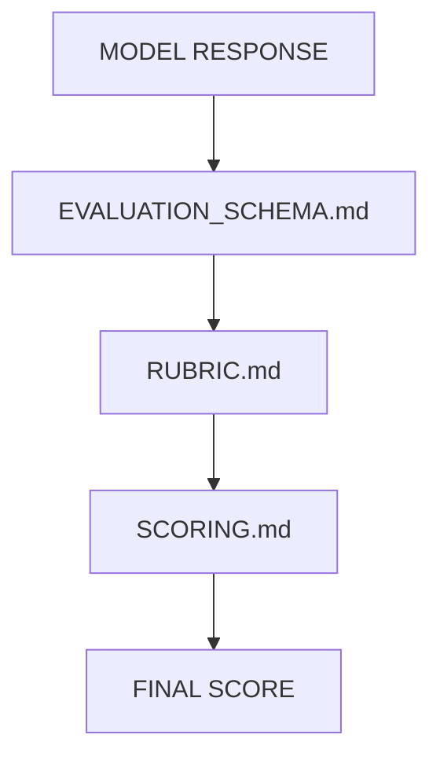
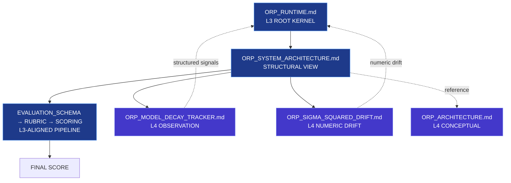

# ORP_META_MAP.md

## System Version
ORP v3.0 (Type-Safe Unified Architecture)

---

## Purpose

This document defines the structural dependency graph of the ORP system.  
It is a static architecture index only.

It does NOT:
- execute logic  
- enforce rules  
- define runtime behavior  
- override `ORP_RUNTIME.md`  

---

# Core Principle

ORP is a directed acyclic document graph (DAG) with strict separation of:

- execution authority (L3)  
- evaluation contracts (L3‑aligned)  
- observational systems (L4)  
- conceptual models (L4)  

Only one node has enforcement authority:  
**`ORP_RUNTIME.md` (L3 Kernel)**

All other documents are descriptive, contractual, or observational.

---

# 1. CORE RUNTIME LAYER (L3 AUTHORITY KERNEL)

## `ORP_RUNTIME.md`

- **Authority:** L3 (exclusive execution authority)  
- **Role:** System governance kernel  
- **Responsibilities:**  
  - SHS state management  
  - Drift computation (σ² model)  
  - LAS enforcement (L1–L4)  
  - Failure handling  
  - Provenance integrity enforcement  
  - System invariants  
- **Dependencies:** NONE (root node)  
- **Dependents:** All downstream layers  

This file defines the **only authoritative runtime behavior**.

---

# 2. ARCHITECTURE DESCRIPTION LAYER (L3-DESCRIPTIVE)

## `ORP_SYSTEM_ARCHITECTURE.md`

- **Authority:** L3-descriptive  
- **Role:** System pipeline explanation  
- **Responsibilities:**  
  - Describe system structure  
  - Define evaluation pipeline flow  
  - Document layer separation  
  - Explain system principles  
- **Dependencies:** `ORP_RUNTIME.md`  
- **Dependents:** Evaluation pipeline  

---

# 3. CONCEPTUAL MODEL LAYER (L4 — NON-AUTHORITATIVE)

## `ORP_ARCHITECTURE.md`

- **Authority:** L4  
- **Role:** Conceptual / metaphorical modeling  
- **Responsibilities:**  
  - Symbolic architecture representations  
  - Cognitive/entropic abstractions  
  - Non-governance conceptual framing  
- **Dependencies:** NONE  
- **Dependents:** NONE  

This layer has **no structural influence** on the system.

---

# 4. OBSERVATIONAL LAYER (L4 — DIAGNOSTIC ONLY)

## `ORP_MODEL_DECAY_TRACKER.md`

- **Authority:** L4  
- **Role:** Drift observation system  
- **Responsibilities:**  
  - Track degradation patterns  
  - Log instruction failures  
  - Record drift signals  
  - Maintain anomaly history  
- **Dependencies:** `ORP_RUNTIME.md` (read-only)  
- **Dependents:** L3 (indirect, via structured signals only)  

## `ORP_SIGMA_SQUARED_DRIFT.md`

- **Authority:** L4  
- **Role:** Numeric drift model definition  
- **Responsibilities:**  
  - Define σ² variance model  
  - Provide drift thresholds  
  - Support L3 drift classification  
- **Dependencies:** NONE  
- **Dependents:** `ORP_RUNTIME.md`  

Observational layers **cannot influence L3 decisions**.

---

# 5. EVALUATION PIPELINE LAYER (L3-ALIGNED CONTRACT SYSTEM)

## Components

- `ORP_EVALUATION_SCHEMA.md`  
- `ORP_RUBRIC.md`  
- `ORP_SCORING.md`  

These files form a **post-hoc evaluation pipeline**.

### Pipeline Flow (Strict Order)



### Roles

- **`ORP_EVALUATION_SCHEMA.md`** — L3-aligned structural contract  
- **`ORP_RUBRIC.md`** — L3-aligned qualitative evaluation  
- **`ORP_SCORING.md`** — L3-aligned quantitative aggregation  

### Constraint

Evaluation is **post-hoc only**.  
It does **NOT** modify runtime behavior or influence `ORP_RUNTIME.md`.

---

# Layer Classification Matrix

| File                        | Layer       | Authority Type      | Role                          |
|-----------------------------|-------------|---------------------|-------------------------------|
| ORP_RUNTIME.md             | L3          | Execution Kernel    | Governance + enforcement      |
| ORP_SYSTEM_ARCHITECTURE.md | L3          | Descriptive Layer   | System structure explanation  |
| ORP_ARCHITECTURE.md        | L4          | Conceptual Model    | Metaphorical system design    |
| ORP_MODEL_DECAY_TRACKER.md | L4          | Observational       | Drift diagnostics             |
| ORP_SIGMA_SQUARED_DRIFT.md | L4          | Observational       | Numeric drift model           |
| ORP_EVALUATION_SCHEMA.md   | L3-aligned  | Contract Layer      | Structural rules              |
| ORP_RUBRIC.md              | L3-aligned  | Evaluation Layer    | Qualitative assessment        |
| ORP_SCORING.md             | L3-aligned  | Aggregation Layer   | Quantitative scoring          |

---

# 6. MANIFEST CONTRACT (v3.0 Requirement)

The ORP system must expose a machine-readable manifest:

- `ORP_SYSTEM_MAP.manifest.json`

This manifest defines:

- DAG structure  
- File dependencies  
- Layer authority  
- Evaluation pipeline order  
- Observational boundaries  
- L3 root kernel identity  

The manifest is **canonical** and must remain synchronized with this meta-map.

---

# Global Design Constraints

1. **Authority Isolation**  
   L4 systems cannot influence L3 decisions.

2. **Runtime Uniqueness**  
   Only `ORP_RUNTIME.md` defines execution behavior.

3. **DAG Integrity**  
   No cyclic dependencies allowed.

4. **Observational Non-Interference**  
   L4 diagnostics are passive only.

5. **Evaluation Non-Governance**  
   Scoring systems cannot modify runtime state.

6. **Manifest Synchronization**  
   All structural changes must update the manifest.

---

# System Graph (Simplified)



---

# Final System State

```yaml
ORP_VERSION: 3.0
GRAPH_MODEL: DIRECTED_ACYCLIC_GRAPH
AUTHORITY_MODEL: L3_SINGLE_ROOT_KERNEL
OBSERVATION_MODEL: L4_PASSIVE
EVALUATION_MODEL: POST_HOC_L3_ALIGNED
MANIFEST: SYNCHRONIZED
INTEGRITY_CONSTRAINT: STRICT_ISOLATION
STATUS: FROZEN
```

---

**END OF SPECIFICATION**
