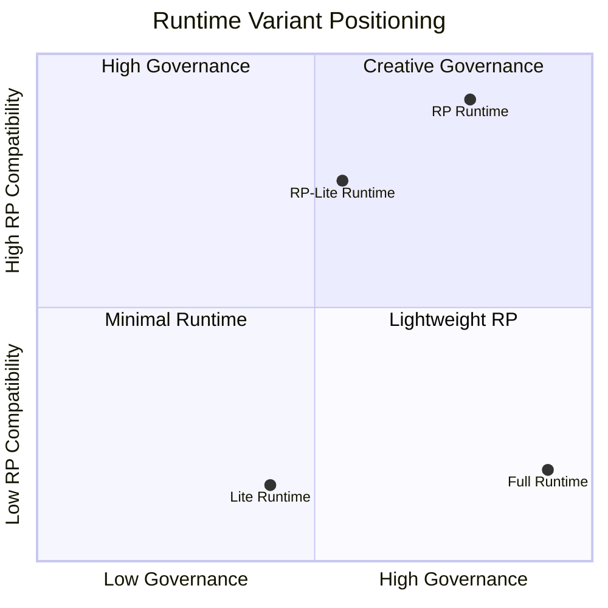
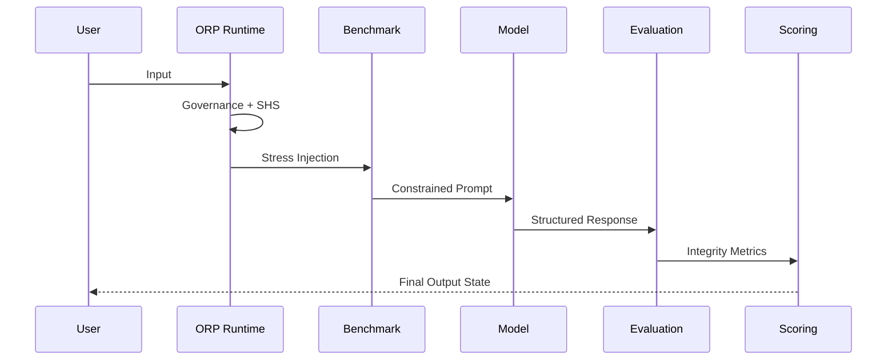

# **ORP_SYSTEM_MAP.md**  
### *Unified Epistemic Governance Architecture — v3.0*  
**Type‑Safe Runtime Governance for Observable Transformer Execution**


---

# **System Version**
**ORP v3.0 — Type‑Safe Unified Architecture**

---

# **Purpose**

This document defines the human‑readable architecture of the ORP system.  
It describes how all components interact as a unified epistemic governance pipeline.

This file acts as:

- Contributor entry point  
- Architecture overview  
- Layer responsibility reference  
- Protocol dependency map  

This file is **NOT**:

- An evaluation tool  
- A scoring document  
- A benchmark specification  

---

# **ORP Operational Philosophy**

- Signal > Narrative  
- Recoverability > Completion  
- Provenance > Fluency  
- Governance > Style  
- Observability > Illusion  

---

# **High‑Level Architecture**


---

# **Repository Structure (Authoritative)**

```text
ORP/
│
├── Architecture/
│   ├── ORP_ARCHITECTURE.md
│   ├── ORP_CORE_SPEC.md
│   ├── ORP_META_MAP.md
│   ├── ORP_SYSTEM_ARCHITECTURE.md
│   ├── ORP_SYSTEM_MAP.manifest.json
│   └── ORP_SYSTEM_MAP.md
│
├── Docs/
│   ├── !REPO_CHECKLIST.md
│   ├── CODE_OF_CONDUCT.md
│   ├── CONTRACT_BRIDGE.md
│   ├── CONTRIBUTING.md
│   ├── NOTICE
│   ├── ORP_COPILOT.md
│   ├── ORP_DESIGN_PHILOSOPHY.md
│   ├── ORP_GEMINI.md
│   ├── ORP_GPT55.md
│   ├── ORP_GROK.md
│   ├── ORP_ORIGIN.md
│   ├── ORP_ROADMAP.md
│   └── index.md
│
├── Evaluation/
│   ├── ORP_BENCHMARK.md
│   ├── ORP_COHERENCE_CAMOUFLAGE.md
│   ├── ORP_EPISTEMIC_ISOLATION.md
│   ├── ORP_EVALUATION_SCHEMA.md
│   ├── ORP_RUBRIC.md
│   ├── ORP_SCORING.md
│   └── ORP_SHS_TRANSITION_TRIGGERS.md
│
├── Governance/
│   ├── ORP_ANTI_DEGRADATION.md
│   ├── ORP_CRA_SPEC.md
│   ├── ORP_DRIFT_RECOVERY_PROTOCOL.md
│   ├── ORP_FAILURE_MODES_CATALOG.md
│   ├── ORP_MODEL_DECAY_TRACKER.md
│   ├── ORP_SIGMA_SQUARED_DRIFT.md
│   └── ORP_UNDERSTANDING_RP_DRIFT_TENDENCY.M
│
├── Runtime/
│   ├── ORP_PROMPT.md
│   ├── ORP_RUNTIME.md
│   ├── ORP_RUNTIME_RP.md
│   ├── ORP_RUNTIME_LITE.md
│   ├── ORP_RUNTIME_RP_LITE.md
│   └── ORP_RUNTIME_VARIANTS.md
│
├── layers/
│   ├── ORP_L1_SIGNAL_SCHEMA.md
│   ├── ORP_L2_VALIDATION_RULES.md
│   └── ORP_L4_INFERENCE_GUIDE.md
│
├── public/
│   ├── avatar.jpg
│   └── index.html
│
├── CHANGELOG.md
├── LICENSE
├── ORP_VERSION
└── README.md
```

---

# **Runtime Variant Matrix**



---

# **Runtime Selection Guide**

| Runtime | Best For | Governance Strength | RP Compatibility | Token Efficiency |
|--------|----------|---------------------|------------------|------------------|
| Full Runtime | Strong production models | Highest | Low | Medium |
| RP Runtime | Creative and immersive sessions | High | Highest | Medium |
| Lite Runtime | Weak or filtered models | Medium | Low | Highest |
| RP‑Lite Runtime | Small RP‑biased models | Medium | High | Highest |

---

# **Optimization Axiom**

> Optimization is the highest form of respect for the hardware.

---

# **Full Pipeline Flow**



---

# **Architectural Layers**

## **L3 — ORP_RUNTIME.md (Authority Kernel)**  
Responsibilities include:

- Mandatory runtime headers  
- SHS state management  
- Numeric drift detection (σ²)  
- Provenance preservation  
- Coherence camouflage detection  
- Runtime failure handling  
- Bounded inference behavior  

**Core Principle:** Governance must remain observable during execution.

---

## **L2 — Runtime Variant Layer**  
Variants:

- Full Runtime  
- RP Runtime  
- Lite Runtime  
- RP‑Lite Runtime  

**Core Principle:** Runtime selection must optimize stability‑to‑cost ratio.

---

## **ORP_BENCHMARK.md — Adversarial Stress Layer**  
Responsibilities:

- Adversarial reasoning tests  
- Counterfactual stability evaluation  
- Hallucination exposure  
- Failure envelope mapping  
- Drift induction testing  

---

## **ORP_SIGMA_SQUARED_DRIFT.md — Numeric Drift Layer**  
Responsibilities:

- Defines σ² variance model  
- Drift severity classification  
- Runtime degradation measurement  
- SHS transition signaling  

---

## **MODEL_RESPONSE — Governed Output Event**  
Responsibilities:

- Constrained reasoning generation  
- Uncertainty serialization  
- Provenance retention  
- SHS‑compliant behavior  

---

## **ORP_EVALUATION_SCHEMA.md — Structural Transformation Layer**  
Responsibilities:

- Atomic claim transformation  
- Epistemic tagging  
- Relationship analysis  
- Reconstruction boundaries  

---

## **ORP_RUBRIC.md — Qualitative Integrity Layer**  
Responsibilities:

- Distortion detection  
- Governance compliance analysis  
- Provenance integrity assessment  

---

## **ORP_SCORING.md — Quantitative Aggregation Layer**  
Responsibilities:

- Weighted scoring  
- SHS‑linked interpretation  
- Drift severity aggregation  

---

## **ORP_ANTI_DEGRADATION.md — Decay Resistance Layer**  
Responsibilities:

- Degradation pattern tracking  
- Runtime decay diagnostics  
- Recovery support  

---

# **Session Health State (SHS)**

| State | Meaning |
|-------|---------|
| GREEN | Stable execution |
| YELLOW | Minor drift indicators |
| ORANGE | Moderate degradation |
| RED | Hard drift / bounded inference only |
| BLACK | Context collapse |

---

# **Layered Authority Stack (LAS)**

| Layer | Meaning |
|-------|---------|
| L1 | Direct evidence / observed typed signals |
| L2 | Verified interpretation / constrained synthesis |
| L3 | Protocol governance / operational rules |
| L4 | Speculation / probabilistic inference |

**Critical Rule:** L4 must never overwrite frozen L1/L2 provenance.

---

# **Coherence Camouflage**

Primary transformer failure mode where stylistic coherence persists while provenance silently degrades.

---

# **Runtime Governance Additions (v3.0)**

ORP v3.0 introduces:

- Type‑Safe Runtime Governance  
- Numeric drift observability  
- SHS‑linked execution control  
- Provenance‑first reasoning discipline  

---

# **Design Principles**

1. Separation of Concerns  
2. No Cross‑Contamination  
3. Epistemic Isolation  
4. Failure Transparency  
5. Recoverability Over Completion  

---

# **Final Principle**

A reasoning system is only as reliable as its ability to preserve provenance under degradation.  
**Signal > Narrative**
