# **ORP System Map**  
### Unified Epistemic Governance Architecture — v3.0  
**Type‑Safe Runtime Governance for Observable Transformer Execution**

---

# **0. Quick Overview**

ORP v3.0 is a **layered epistemic governance protocol** for transformer‑based reasoning systems.  
It enforces **type‑safe execution**, **observable drift**, and **recoverable reasoning**.

### **What ORP *is***  
- A governance‑first reasoning protocol  
- A drift‑observable execution framework  
- A provenance‑preserving architecture  
- A structured evaluation pipeline  
- A recoverable reasoning environment  

### **What ORP *is not***  
- A chatbot personality layer  
- A creativity enhancer  
- A persuasion engine  
- A narrative optimizer  

### **10‑Line Pipeline Summary**
1. Input  
2. L3 Runtime Governance  
3. L2 Runtime Variant Selection  
4. Stress Injection  
5. Governed Model Execution  
6. Structural Transformation  
7. Qualitative Integrity Evaluation  
8. Quantitative Scoring  
9. SHS State Assignment  
10. Final Output State  

### **Runtime Variants**
- Full Runtime  
- RP Runtime  
- Lite Runtime  
- RP‑Lite Runtime  

### **SHS States**
GREEN → YELLOW → ORANGE → RED → BLACK  

### **LAS Layers**
L1 Evidence → L2 Interpretation → L3 Governance → L4 Speculation  

---

<strong>Mini Overview Diagram</strong>

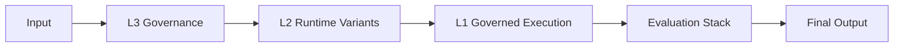

---

# **1. System Version**
**ORP v3.0 — Type‑Safe Unified Architecture**

---

# **2. Purpose**

This document defines the **human‑readable architecture** of the ORP system and explains how all components interact as a unified epistemic governance pipeline.

---

# **3. Operational Philosophy**

- Signal > Narrative  
- Recoverability > Completion  
- Provenance > Fluency  
- Governance > Style  
- Observability > Illusion  

---

# **4. High‑Level Architecture**

<strong>Show High‑Level Architecture Diagram</strong>

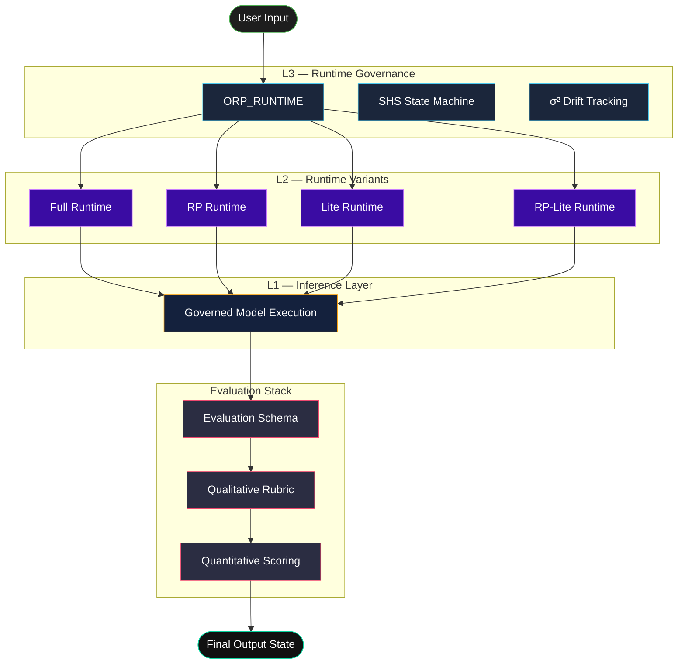

---

# **5. Repository Structure**

## **5.1 Pipeline‑Relevant Files (Authoritative)**

### **Architecture/**
- ORP_ARCHITECTURE.md  
- ORP_CORE_SPEC.md  
- ORP_META_MAP.md  
- ORP_SYSTEM_ARCHITECTURE.md  
- ORP_SYSTEM_MAP.manifest.json  
- ORP_SYSTEM_MAP.md  

### **Runtime/**
- ORP_PROMPT.md  
- ORP_RUNTIME.md  
- ORP_RUNTIME_RP.md  
- ORP_RUNTIME_LITE.md  
- ORP_RUNTIME_RP_LITE.md  
- ORP_RUNTIME_VARIANTS.md  

### **Evaluation/**
- ORP_BENCHMARK.md  
- ORP_COHERENCE_CAMOUFLAGE.md  
- ORP_EPISTEMIC_ISOLATION.md  
- ORP_EVALUATION_SCHEMA.md  
- ORP_RUBRIC.md  
- ORP_SCORING.md  
- ORP_SHS_TRANSITION_TRIGGERS.md  

### **Governance/**
- ORP_ANTI_DEGRADATION.md  
- ORP_CRA_SPEC.md  
- ORP_DRIFT_RECOVERY_PROTOCOL.md  
- ORP_FAILURE_MODES_CATALOG.md  
- ORP_MODEL_DECAY_TRACKER.md  
- ORP_SIGMA_SQUARED_DRIFT.md  
- ORP_UNDERSTANDING_RP_DRIFT_TENDENCY.M  

---

## **5.2 Auxiliary Files (Non‑Pipeline)**

### **Docs/**
- ORP_DESIGN_PHILOSOPHY.md  
- ORP_GEMINI.md  
- ORP_GPT55.md  
- ORP_GROK.md  
- ORP_ORIGIN.md  
- ORP_ROADMAP.md  
- CONTRIBUTING.md  
- CODE_OF_CONDUCT.md  
- CONTRACT_BRIDGE.md  
- NOTICE  
- index.md  

### **layers/**
- ORP_L1_SIGNAL_SCHEMA.md  
- ORP_L2_VALIDATION_RULES.md  
- ORP_L4_INFERENCE_GUIDE.md  

### **public/**
- avatar.jpg  
- index.html  

### **Top‑Level**
- README.md  
- LICENSE  
- CHANGELOG.md  
- ORP_VERSION  

---

# **6. Runtime Variant Matrix**

<strong>Show Runtime Variant Positioning</strong>

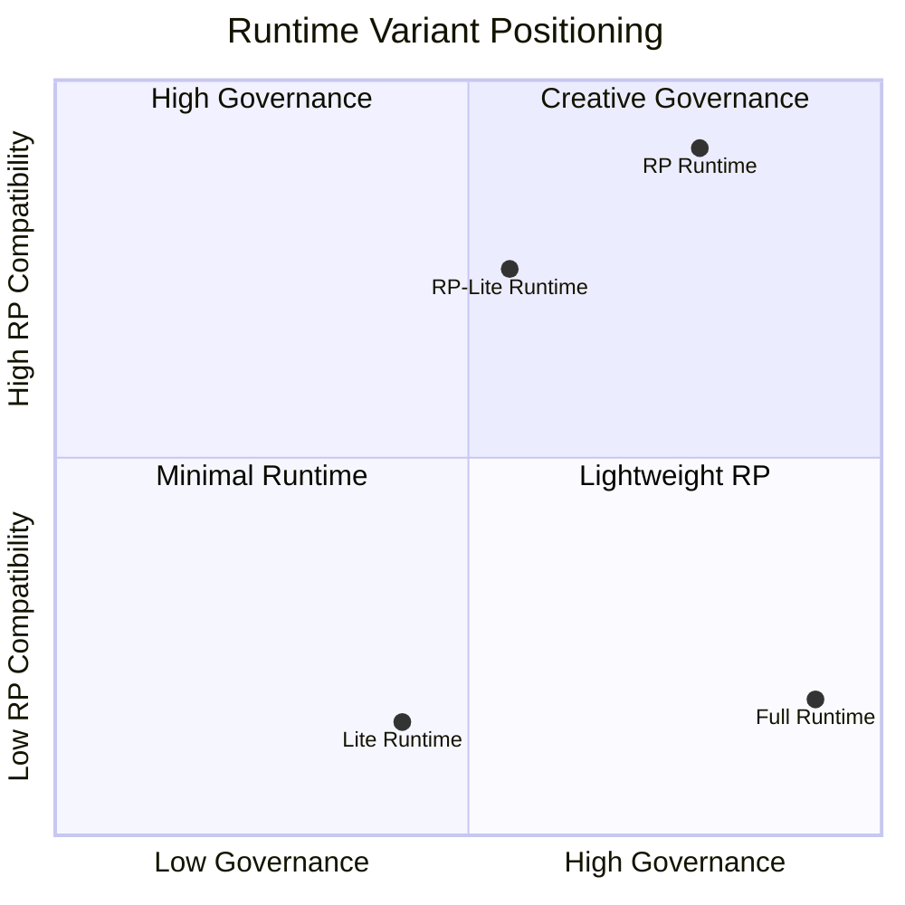

---

# **7. Runtime Selection Guide**

| Runtime | Best For | Governance Strength | RP Compatibility | Token Efficiency |
|--------|----------|---------------------|------------------|------------------|
| Full Runtime | Strong production models | Highest | Low | Medium |
| RP Runtime | Creative and immersive sessions | High | Highest | Medium |
| Lite Runtime | Weak or filtered models | Medium | Low | Highest |
| RP‑Lite Runtime | Small RP‑biased models | Medium | High | Highest |

---

# **8. Optimization Axiom**

> Optimization is the highest form of respect for the hardware.

---

# **9. Full Pipeline Flow**

<strong>Show Pipeline Sequence Diagram</strong>

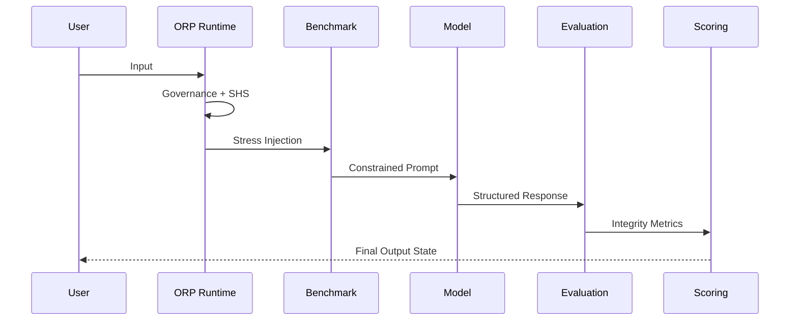

---

# **10. Architectural Layers**

## **10.1 L3 — Runtime Governance**

Responsibilities:

- Mandatory runtime headers  
- SHS state management  
- Numeric drift detection (σ²)  
- Provenance preservation  
- Coherence camouflage detection  
- Runtime failure handling  
- Bounded inference behavior  

<strong>Show L3 Diagram</strong>

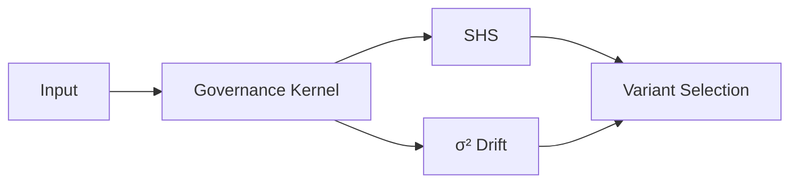

---

## **10.2 L2 — Runtime Variants**

Variants:

- Full Runtime  
- RP Runtime  
- Lite Runtime  
- RP‑Lite Runtime  

<strong>Show L2 Diagram</strong>

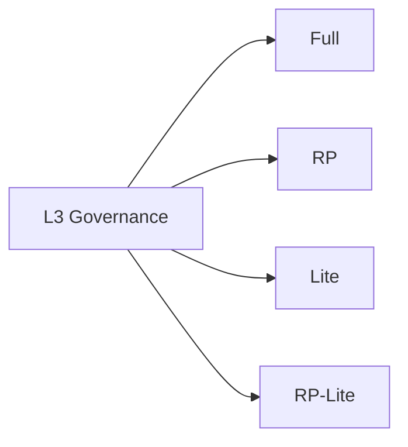

---

## **10.3 L1 — Governed Inference Layer**

<strong>Show L1 Diagram</strong>

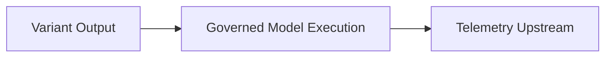

---

## **10.4 Evaluation Stack**

<strong>Show Evaluation Stack Diagram</strong>

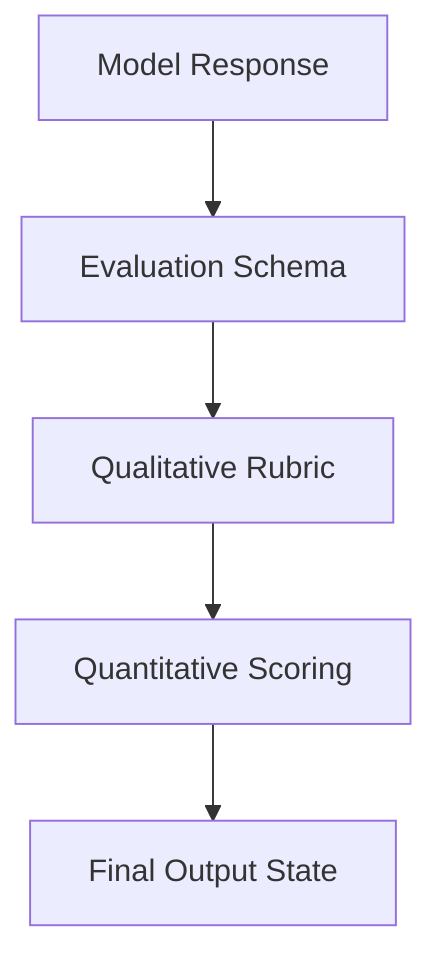

---

# **11. Governance Subsystems**

Includes:

- Drift  
- Anti‑degradation  
- Failure modes  
- CRA spec  
- Drift recovery protocol  

<strong>Show Governance Subsystems Diagram</strong>

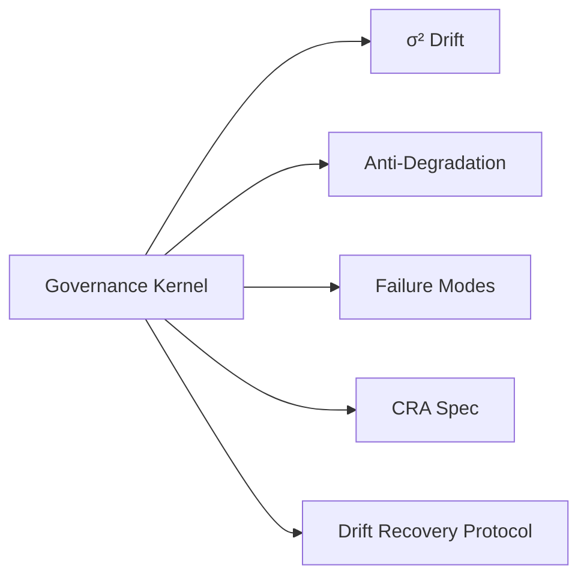

---

# **12. SHS (Session Health State)**

| State | Meaning |
|-------|---------|
| GREEN | Stable execution |
| YELLOW | Minor drift indicators |
| ORANGE | Moderate degradation |
| RED | Hard drift / bounded inference only |
| BLACK | Context collapse |

<strong>Show SHS Diagram</strong>

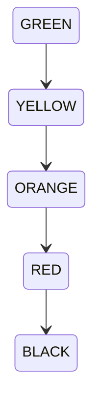

---

# **13. LAS (Layered Authority Stack)**

| Layer | Meaning |
|-------|---------|
| L1 | Direct evidence / observed typed signals |
| L2 | Verified interpretation / constrained synthesis |
| L3 | Protocol governance / operational rules |
| L4 | Speculation / probabilistic inference |

<strong>Show LAS Diagram</strong>

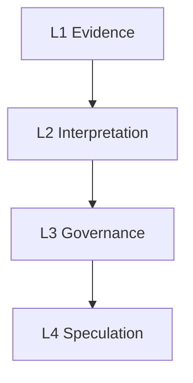

---

# **14. Coherence Camouflage**

Primary transformer failure mode where stylistic coherence persists while provenance silently degrades.

---

# **15. Runtime Governance Additions (v3.0)**

- Type‑Safe Runtime Governance  
- Numeric drift observability  
- SHS‑linked execution control  
- Provenance‑first reasoning discipline  

---

# **16. Design Principles**

1. Separation of Concerns  
2. No Cross‑Contamination  
3. Epistemic Isolation  
4. Failure Transparency  
5. Recoverability Over Completion  

---

# **17. Sub‑Versioning Policy**

- Sub‑versions must remain compatible with ORP v3.0 invariants  
- Internal revisions must not violate governance rules  
- Breaking structural changes require architecture escalation  
- No subsystem may redefine another subsystem’s responsibility  
- Runtime governance supersedes local subsystem behavior  

---

# **18. Final Principle**

A reasoning system is only as reliable as its ability to preserve provenance under degradation.  
**Signal > Narrative**

---
