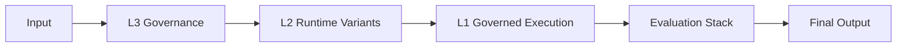

### Unified Epistemic Governance Architecture — v3.0

**Type-Safe Runtime Governance for Observable Transformer Execution**

---

# **0. Layer Classification (CRITICAL)**

This document is classified as:

> **L0 — Architectural Epistemic Map (Non-Executable, Non-Governing)**

It is:

* NOT part of runtime execution
* NOT part of governance enforcement
* NOT part of drift computation

It exists only to:

* describe system structure
* provide navigation topology
* define conceptual relationships between subsystems

---

## **Authority Constraint**

If any contradiction arises between this map and runtime behavior:

> **ORP_RUNTIME.md (L3) is always authoritative**

---

# **1. Quick Overview**

ORP v3.0 is a **layered epistemic governance protocol** for transformer-based reasoning systems.
It enforces **type-safe execution**, **observable drift**, and **recoverable reasoning**.

### **What ORP *is***

* A governance-first reasoning protocol
* A drift-observable execution framework
* A provenance-preserving architecture
* A structured evaluation pipeline
* A recoverable reasoning environment

### **What ORP *is not***

* A chatbot personality layer
* A creativity enhancer
* A persuasion engine
* A narrative optimizer

---

## **10-Line Pipeline Summary**

1. Input
2. L3 Runtime Governance
3. L2 Runtime Variant Selection
4. Stress Injection
5. Governed Model Execution
6. Structural Transformation
7. Qualitative Integrity Evaluation
8. Quantitative Scoring
9. SHS State Assignment
10. Final Output State

---

## **Runtime Variants**

* Full Runtime
* RP Runtime
* Lite Runtime
* RP-Lite Runtime

---

## **SHS States**

GREEN → YELLOW → ORANGE → RED → BLACK

---

## **LAS Layers**

* L1 Evidence
* L2 Interpretation
* L3 Governance
* L4 Speculation

---

<strong>Mini Overview Diagram</strong>

---

# **2. System Version**

ORP v3.0 — Type-Safe Unified Architecture

---

# **3. Purpose**

This document defines the **human-readable architecture** of the ORP system and explains how all components interact as a unified epistemic governance pipeline.

---

# **4. Operational Philosophy**

* Signal > Narrative
* Recoverability > Completion
* Provenance > Fluency
* Governance > Style
* Observability > Illusion

---

# **5. High-Level Architecture**

<strong>Show High-Level Architecture Diagram</strong>

---

# **6. Repository Structure**

## **6.1 Pipeline-Authoritative Files**

### Architecture/

* ORP_ARCHITECTURE.md
* ORP_CORE_SPEC.md
* ORP_META_MAP.md
* ORP_SYSTEM_ARCHITECTURE.md
* ORP_SYSTEM_MAP.md

### Runtime/

* ORP_RUNTIME.md
* ORP_RUNTIME_RP.md
* ORP_RUNTIME_LITE.md
* ORP_RUNTIME_RP_LITE.md
* ORP_RUNTIME_VARIANTS.md

### Evaluation/

* ORP_EVALUATION_SCHEMA.md
* ORP_RUBRIC.md
* ORP_SCORING.md
* ORP_BENCHMARK.md
* ORP_SHS_TRANSITION_TRIGGERS.md

### Governance/

* ORP_SIGMA_SQUARED_DRIFT.md
* ORP_ANTI_DEGRADATION.md
* ORP_FAILURE_MODES_CATALOG.md
* ORP_MODEL_DECAY_TRACKER.md
* ORP_DRIFT_RECOVERY_PROTOCOL.md

---

## **6.2 Auxiliary Files**

### Docs/

* ORP_DESIGN_PHILOSOPHY.md
* ORP_ROADMAP.md
* ORP_ORIGIN.md
* CONTRIBUTING.md
* CODE_OF_CONDUCT.md
* README.md

### layers/

* ORP_L1_SIGNAL_SCHEMA.md
* ORP_L2_VALIDATION_RULES.md
* ORP_L4_INFERENCE_GUIDE.md

---

# **7. Runtime Variant Matrix**

(unchanged structure retained)

---

# **8. System Principles**

* Separation of Concerns
* No Cross-Contamination
* Epistemic Isolation
* Failure Transparency
* Recoverability Over Completion

---

# **9. SHS Model**

GREEN → YELLOW → ORANGE → RED → BLACK

---

# **10. LAS Model**

L1 → L2 → L3 → L4

---

# **11. Coherence Camouflage**

Failure mode where stylistic coherence persists while provenance degrades.

---

# **12. Final Principle**

A reasoning system is only as reliable as its ability to preserve provenance under degradation.

> Signal > Narrative

---

# **STATUS**

L0 Architectural Map Layer
Non-Executable System Topology

---

**End of Document**
