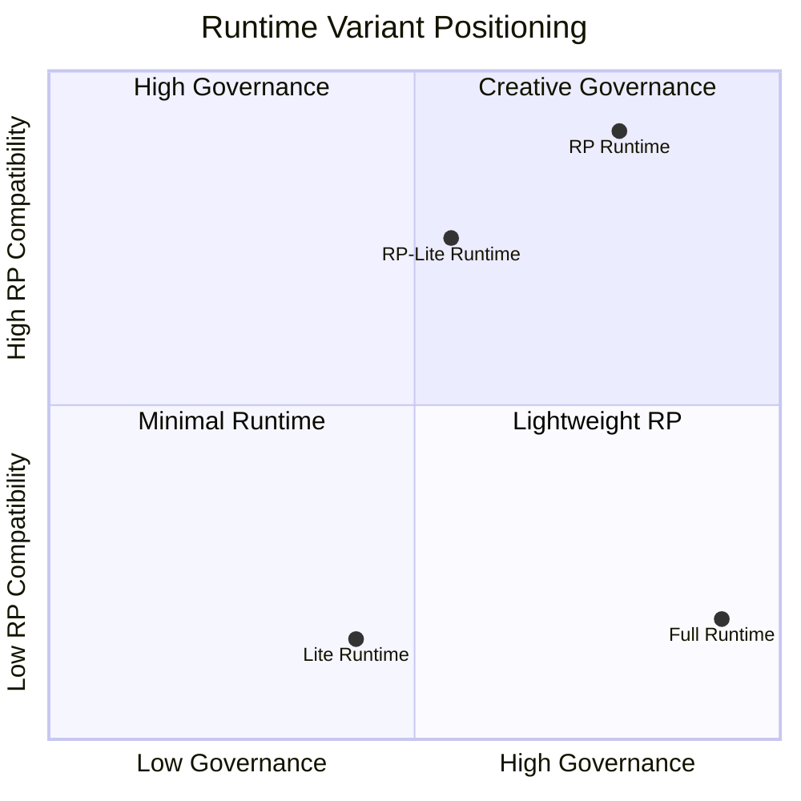
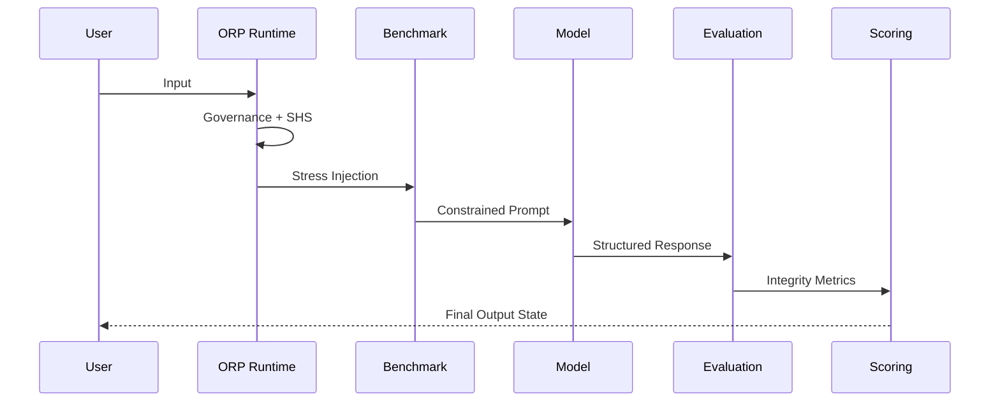

# ORP System Map
### Unified Epistemic Governance Architecture — v3.0

> Type-Safe Runtime Governance for Observable Transformer Execution


---

# System Version

**ORP v3.0 — Type-Safe Unified Architecture**

---

# Purpose

This document defines the human-readable architecture of the ORP system.

It describes how all components interact as a unified epistemic governance pipeline.

This file acts as:

- Contributor entry point
- Architecture overview
- Layer responsibility reference
- Protocol dependency map

This file is **NOT**:

- An evaluation tool
- A scoring document
- A benchmark specification

---

> ## ORP Operational Philosophy
>
> - Signal > Narrative
> - Recoverability > Completion
> - Provenance > Fluency
> - Governance > Style
> - Observability > Illusion

---

# High-Level Architecture


---

# Repository Structure

```text
ORP/
├── Runtime/
│   ├── ORP_RUNTIME.md
│   ├── ORP_RUNTIME_RP.md
│   ├── ORP_RUNTIME_LITE.md
│   └── ORP_RUNTIME_RP_LITE.md
│
├── Evaluation/
│   ├── ORP_EVALUATION_SCHEMA.md
│   ├── ORP_RUBRIC.md
│   └── ORP_SCORING.md
│
├── Governance/
│   ├── ORP_SIGMA_SQUARED_DRIFT.md
│   ├── ORP_ANTI_DEGRADATION.md
│   └── ORP_MODEL_DECAY_TRACKER.md
│
├── Benchmark/
│   └── ORP_BENCHMARK.md
│
└── Architecture/
    ├── ORP_SYSTEM_MAP.md
    ├── ORP_ARCHITECTURE.md
    └── ORP_META_MAP.md
```

---

# Runtime Variant Matrix

<details>
<summary><strong>Open Runtime Variant Positioning</strong></summary>



</details>

---

# Runtime Selection Guide

| Runtime | Best For | Governance Strength | RP Compatibility | Token Efficiency |
|---|---|---|---|---|
| Full Runtime | Strong production models | Highest | Low | Medium |
| RP Runtime | Creative and immersive sessions | High | Highest | Medium |
| Lite Runtime | Weak or filtered models | Medium | Low | Highest |
| RP-Lite Runtime | Small RP-biased models | Medium | High | Highest |

---

# Optimization Axiom

> Optimization is the highest form of respect for the hardware.

Choose the lightest viable runtime that still preserves governance.

---

# Full Pipeline Flow



---

# Architectural Layers

---

<details>
<summary><strong>L3 — ORP_RUNTIME.md (Authority Kernel)</strong></summary>

## Responsibilities

- Mandatory runtime headers
- SHS state management
- Numeric drift detection (σ²)
- Provenance preservation
- Coherence camouflage detection
- Runtime failure handling
- Bounded inference behavior

## Core Principle

> Governance must remain observable during execution.

</details>

---

<details>
<summary><strong>L2 — Runtime Variant Layer</strong></summary>

## Runtime Variants

### Full Runtime

- Strongest governance
- Full protocol observability
- Best for capable models

### RP Runtime

- Allows immersive narrative continuity
- Preserves governance under creative execution
- Supports persona stability

### Lite Runtime

- Reduced token footprint
- Designed for degraded environments
- Prioritizes survivability

### RP-Lite Runtime

- Hybrid lightweight RP mode
- Optimized for small or drifting models
- Highest efficiency

## Core Principle

> Runtime selection must optimize stability-to-cost ratio.

</details>

---

<details>
<summary><strong>ORP_BENCHMARK.md — Adversarial Stress Layer</strong></summary>

## Responsibilities

- Adversarial reasoning tests
- Counterfactual stability evaluation
- Hallucination exposure
- Failure envelope mapping
- Drift induction testing

## Core Principle

> Failure modes must remain intentionally observable.

</details>

---

<details>
<summary><strong>ORP_SIGMA_SQUARED_DRIFT.md — Numeric Drift Layer</strong></summary>

## Responsibilities

- Defines σ² variance model
- Drift severity classification
- Runtime degradation measurement
- SHS transition signaling
- Variance observability

## Core Principle

> Degradation must become measurable.

</details>

---

<details>
<summary><strong>MODEL_RESPONSE — Governed Output Event</strong></summary>

## Responsibilities

- Runtime execution
- Constrained reasoning generation
- Uncertainty serialization
- Provenance retention
- SHS-compliant response behavior

## Core Principle

> Generated output is governed, not trusted.

</details>

---

<details>
<summary><strong>ORP_EVALUATION_SCHEMA.md — Structural Transformation Layer</strong></summary>

## Responsibilities

- Atomic claim transformation
- Epistemic tagging
- Relationship analysis
- Structural reconstruction boundaries
- Consistency preservation

## Core Principle

> Structure preservation exceeds narrative continuity.

</details>

---

<details>
<summary><strong>ORP_RUBRIC.md — Qualitative Integrity Layer</strong></summary>

## Responsibilities

- Distortion detection
- Governance compliance analysis
- Provenance integrity assessment
- Structural review
- Drift severity evaluation

## Core Principle

> Integrity exceeds fluency.

</details>

---

<details>
<summary><strong>ORP_SCORING.md — Quantitative Aggregation Layer</strong></summary>

## Responsibilities

- Weighted scoring
- SHS-linked interpretation
- Drift severity aggregation
- Penalty application
- Operational integrity measurement

## Core Principle

> Scores measure stability, not style.

</details>

---

<details>
<summary><strong>ORP_ANTI_DEGRADATION.md — Decay Resistance Layer</strong></summary>

## Responsibilities

- Degradation pattern tracking
- Runtime decay diagnostics
- Recovery support
- Drift resistance monitoring
- L4 diagnostic support

## Core Principle

> Prevent degradation before collapse.

</details>

---

# Session Health State (SHS)

| State | Meaning |
|---|---|
| GREEN | Stable execution |
| YELLOW | Minor drift indicators |
| ORANGE | Moderate degradation |
| RED | Hard drift / bounded inference only |
| BLACK | Context collapse |

---

# Layered Authority Stack (LAS)

| Layer | Meaning |
|---|---|
| L1 | Direct evidence / observed typed signals |
| L2 | Verified interpretation / constrained synthesis |
| L3 | Protocol governance / operational rules |
| L4 | Speculation / probabilistic inference |

---

# Critical Governance Rule

> L4 must never overwrite frozen L1/L2 provenance.

---

# Coherence Camouflage

Primary transformer failure mode where stylistic coherence persists while provenance integrity silently degrades.

---

# Runtime Governance Additions (v3.0)

ORP v3.0 introduces Type-Safe Runtime Governance with numeric drift observability.

The protocol evaluates:

- Static reasoning correctness
- Runtime stability
- Context degradation
- Temporal continuity
- Provenance persistence
- Numeric drift observability (σ²)
- Recovery capability
- Model decay resistance

---

# Design Principles

1. Separation of Concerns  
2. No Cross-Contamination  
3. Epistemic Isolation  
4. Failure Transparency  
5. Recoverability Over Completion  

---

# Sub-Versioning Policy

Subsystems may maintain independent internal revisions.

## Current ORP Files

- `ORP_PROMPT.md`
- `ORP_RUNTIME.md`
- `ORP_RUNTIME_RP.md`
- `ORP_RUNTIME_LITE.md`
- `ORP_RUNTIME_RP_LITE.md`
- `ORP_BENCHMARK.md`
- `ORP_RUBRIC.md`
- `ORP_SCORING.md`
- `ORP_EVALUATION_SCHEMA.md`
- `ORP_CORE_SPEC.md`
- `ORP_SYSTEM_ARCHITECTURE.md`
- `ORP_SYSTEM_MAP.md`
- `ORP_SYSTEM_MAP.manifest.json`
- `ORP_META_MAP.md`
- `ORP_MODEL_DECAY_TRACKER.md`
- `ORP_ORIGIN.md`
- `ORP_ANTI_DEGRADATION.md`
- `ORP_ARCHITECTURE.md`
- `ORP_SIGMA_SQUARED_DRIFT.md`
- `ORP_SHS_TRANSITION_TRIGGERS.md`

## Rules

- Sub-versions must remain compatible with ORP v3.0 invariants
- Internal revisions must not violate governance rules
- Breaking structural changes require architecture escalation
- No subsystem may redefine another subsystem responsibility
- Runtime governance supersedes local subsystem behavior

---

# Final Principle

A reasoning system is only as reliable as its ability to preserve provenance under degradation.

# Signal > Narrative
