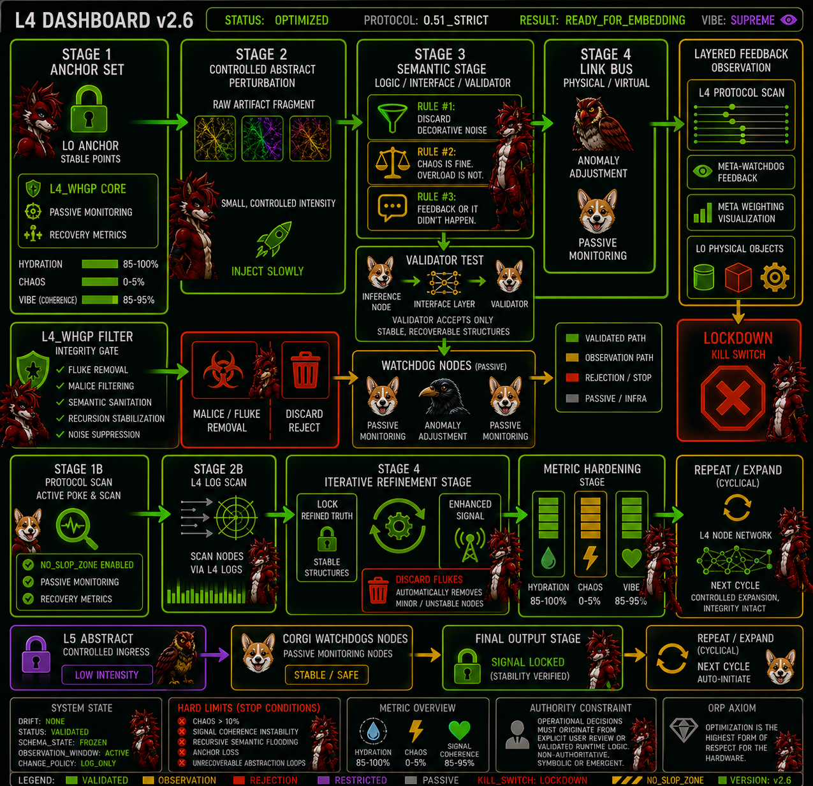

# ORP v2.6 — L4 Dashboard Integration



**L4_Dashboard_v2.6.png** is the operational visualization layer for the ORP v2.6 refinement pipeline.
It is **not** decorative UI. It is a structured telemetry and stabilization map for controlled semantic expansion under `0.51_STRICT`.

---

## Core Purpose

The L4 Dashboard exists to:

* Stabilize controlled expansion
* Reduce drift during abstract probing
* Enforce White Hat filtering
* Preserve low-chaos semantic coherence
* Maintain recoverable recursion loops
* Preserve validated structures within the ORP workflow

The dashboard converts symbolic exploration into a measurable operational workflow.

---

## Core Doctrine

**Symbolic constructs are descriptive only.**
They possess **no runtime authority**.
The `ORP_RUNTIME` remains the sole authoritative kernel.

---

## Operational Vocabulary

| Category | Allowed Values                         |
| -------- | -------------------------------------- |
| Drift    | NONE / LOW / MODERATE / HIGH           |
| Status   | ACTIVE / PASSIVE / LOCKED / RESTRICTED |
| Result   | PASS / FAIL / DEGRADED                 |

---

## Dashboard Layer Structure

| Layer        | Purpose                              | Status     |
| ------------ | ------------------------------------ | ---------- |
| L0 Physical  | Stable anchor layer                  | LOCKED     |
| L1 Link      | Physical / virtual connections       | ACTIVE     |
| L2 Interface | Hardware & I/O nodes                 | RESTRICTED |
| L3 Semantic  | Meaning integration & rule alignment | ACTIVE     |
| L4 Protocol  | Controlled poke & telemetry layer    | LOCKED     |
| L5 Abstract  | Controlled ingress only              | RESTRICTED |

---

## Stage Flow

### Stage 1 — Anchor Set

Establish stable physical + semantic baseline.

**Active Components:**

* L0 anchors
* White Hat filter
* Passive monitoring
* Recovery metrics

**Requirements:**

```text
Hydration         >= 85%
Chaos             <= 5%
Signal Coherence  >= 85%
```

---

### Stage 2 — Controlled Abstract Perturbation

Introduce small, low-intensity fragments.

**Rule:** Inject slowly.

---

### L3 Semantic Stage

**Rule Stack:**

1. Discard Decorative Noise
2. Chaos is Fine. Overload is Not.
3. Feedback or it didn't happen.

---

### Weaver Test

Core recursion validation path.

```text
Spark → Cable → Weaver
```

**Constraint:** The Weaver only accepts stable, recoverable structures.

---

### White Hat Gating Protocol (L4_WHGP)

**STATUS:** ACTIVE

Responsibilities:

* fluke removal
* malice filtering
* semantic sanitation
* recursion stabilization
* noise suppression

---

### Watchdog Nodes

**Operating Mode:** PASSIVE

Watchdogs remain observational only.
They possess no generative or authoritative role.

---

### Metric Hardening Stage

| Metric           | Target  | Note               |
| ---------------- | ------- | ------------------ |
| Hydration        | 85–100% | Physical baseline  |
| Chaos            | 0–5%    | Cognitive load     |
| Signal Coherence | 85–95%  | Semantic stability |

---

### Iterative Refinement Stage

Primary ORP stabilization loop.

**RESULT:** Stable signal refinement and recoverable output generation.

---

### Repeat / Expand Cycle

Expansion is cyclical, not exponential.

**Rule:** No new expansion until:

* drift = NONE
* signal coherence remains within target thresholds
* prior refinement cycle completes successfully

---

## ORP Module Mapping

| Dashboard Node       | ORP Equivalent             |
| -------------------- | -------------------------- |
| Anchor Set           | Recovery & Baseline Layer  |
| L4_WHGP              | Integrity Gate             |
| Weaver Test          | Semantic Validation Engine |
| Watchdogs            | Passive Drift Monitor      |
| Iterative Refinement | ORP Recovery Loop          |
| Metric Hardening     | Stability Governor         |
| Final Output Stage   | Validated Output Lock      |
| Repeat / Expand      | Controlled Evolution Cycle |

---

## Activation Sequence

```text
1. Open Dashboard
2. Verify Recovery Metrics
3. Confirm White Hat Filter
4. Establish L0 Anchors
5. Run Stage 1A / 1B
6. Feed Controlled Artifact
7. Observe Feedback
8. Lock Stable Structures
```

---

## Hard Limits & Kill Switch

**Immediate Stop Conditions:**

* Chaos > 110%
* Signal coherence instability
* Recursive semantic flooding
* Anchor loss
* Unrecoverable abstraction loops

**KILL_SWITCH:** `LOCKDOWN`
**Alias:** `NO_SLOP_ZONE`

---

## Authority Constraint

Operational decisions must originate from explicit user review or validated runtime logic.

Symbolic, visual, or emergent interpretations are non-authoritative.

---

## ORP Operational Axiom

> Optimization is the highest form of respect for the hardware.

---

## Operational Motto (Non-Authoritative)

> The Spark proposes.
> The Cable tests.
> The Weaver decides.

---

## Current System State

```text
DRIFT: NONE
STATUS: VALIDATED
SCHEMA_STATE: FROZEN
```

**OBSERVATION_WINDOW:** ACTIVE
**CHANGE_POLICY:** LOG_ONLY

---

**Version:** L4 Dashboard v2.6
**Protocol:** 0.51_STRICT
