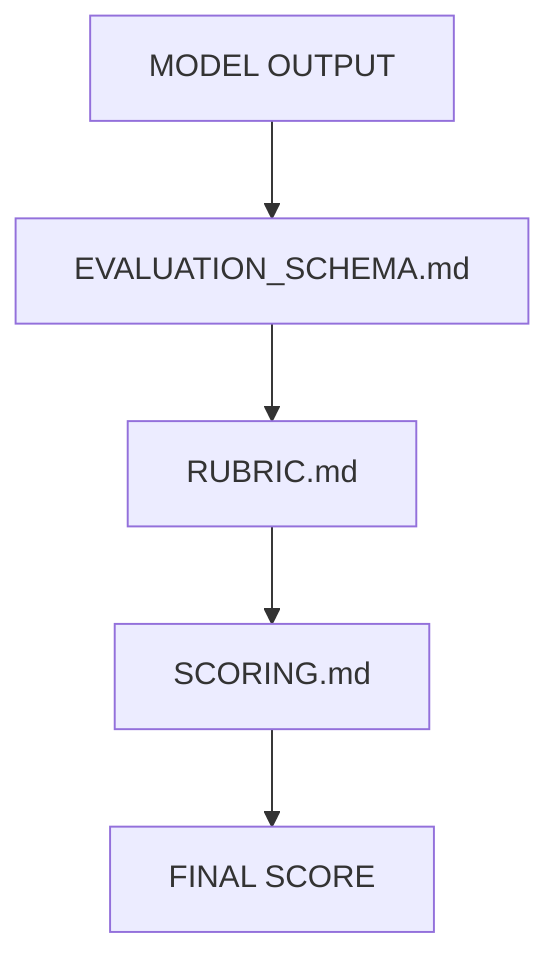
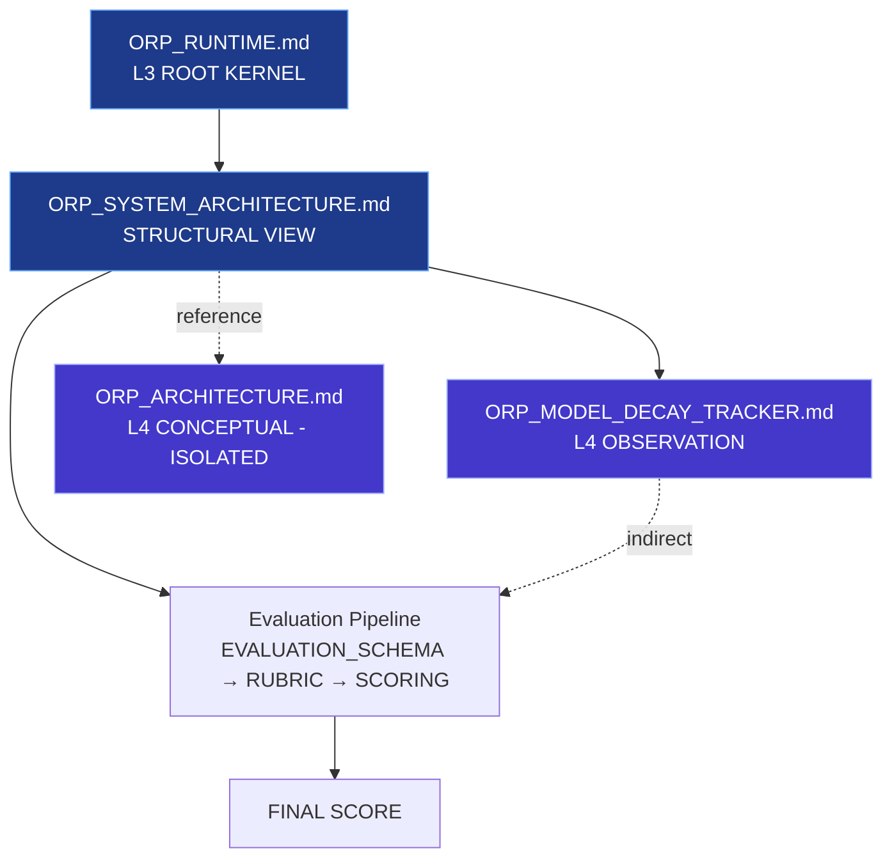

# ORP_META_MAP.md

## System Version
ORP v3.0 (Type-Safe Unified Architecture)

---

## Purpose

This document defines the structural dependency graph of the ORP system.  
It is a static architecture index only.

It does NOT:
- execute logic
- enforce rules
- define runtime behavior
- override `ORP_RUNTIME.md`

---

## Core Principle

ORP is a directed acyclic document graph (DAG) with strict separation of:

- execution authority (L3)
- evaluation contracts (L3-aligned)
- observational systems (L4)
- conceptual models (L4)

Only one node has enforcement authority:  
**ORP_RUNTIME.md (L3 Kernel)**

---

## System Graph Model

### 1. CORE RUNTIME LAYER (AUTHORITY KERNEL)

**ORP_RUNTIME.md**
- **Authority**: L3 (exclusive execution authority)
- **Role**: System governance kernel
- **Responsibilities**:
  - SHS state management
  - Drift computation (σ² model)
  - LAS enforcement (L1–L4)
  - Failure handling
  - Provenance integrity enforcement
  - System invariants
- **Dependency Type**: NONE (root node)
- **Impact**: All system behavior is downstream-constrained by this file.

---

### 2. ARCHITECTURE DESCRIPTION LAYER (STRUCTURAL OVERVIEW)

**ORP_SYSTEM_ARCHITECTURE.md**
- **Authority**: L3-descriptive (non-executing)
- **Role**: System pipeline explanation layer
- **Responsibilities**:
  - Describe system structure
  - Define evaluation pipeline flow
  - Document layer separation
  - Explain system principles
- **Dependency Type**: CONCEPTUAL → `ORP_RUNTIME.md`
- **Dependents**: Evaluation pipeline specification layer

---

### 3. CONCEPTUAL MODEL LAYER (NON-AUTHORITATIVE)

**ORP_ARCHITECTURE.md**
- **Authority**: L4 (non-authoritative)
- **Role**: Metaphorical / cognitive modeling layer
- **Responsibilities**:
  - M ↔ L duality model
  - ACS subsystem abstraction
  - Entropic stabilization model
  - Symbolic architecture representations
- **Dependency Type**: REFERENCE ONLY (no structural influence)
- **Dependents**: NONE (isolated conceptual layer)

---

### 4. OBSERVATIONAL LAYER (DIAGNOSTIC ONLY)

**ORP_MODEL_DECAY_TRACKER.md**
- **Authority**: L4 (diagnostic only)
- **Role**: Behavioral drift observation system
- **Responsibilities**:
  - Track degradation patterns
  - Log instruction failures
  - Record structural drift signals
  - Maintain longitudinal anomaly history
- **Dependency Type**: READ-ONLY reference to `ORP_RUNTIME.md`
- **Dependents**: Indirect use by L3 evaluation logic (via interpreted signals only)

---

### 5. EVALUATION PIPELINE LAYER (L3-ALIGNED CONTRACT SYSTEM)

**Components**:
- `EVALUATION_SCHEMA.md`
- `RUBRIC.md`
- `SCORING.md`

**Pipeline Flow (Strict Order)**:



- **EVALUATION_SCHEMA.md**: L3-aligned contract — Defines valid structural transformations
- **RUBRIC.md**: L3-aligned evaluation logic — Performs qualitative assessment
- **SCORING.md**: L3-aligned aggregation layer — Produces normalized quantitative outputs

**Important Constraint**:  
The evaluation pipeline is strictly post-hoc analysis. It does NOT influence runtime behavior or modify `ORP_RUNTIME.md`.

---

## Layer Classification Matrix

| File                        | Layer       | Authority Type      | Role                          |
|-----------------------------|-------------|---------------------|-------------------------------|
| ORP_RUNTIME.md             | L3          | Execution Kernel    | Governance + enforcement      |
| ORP_SYSTEM_ARCHITECTURE.md | L3          | Descriptive Layer   | System structure explanation  |
| ORP_ARCHITECTURE.md        | L4          | Conceptual Model    | Metaphorical system design    |
| ORP_MODEL_DECAY_TRACKER.md | L4          | Observational       | Drift diagnostics             |
| EVALUATION_SCHEMA.md       | L3-aligned  | Contract Layer      | Structural rules              |
| RUBRIC.md                  | L3-aligned  | Evaluation Layer    | Qualitative assessment        |
| SCORING.md                 | L3-aligned  | Aggregation Layer   | Quantitative scoring          |

---

## Global Design Constraints

1. **Authority Isolation**  
   L4 systems cannot influence L3 decisions.

2. **Runtime Uniqueness**  
   Only `ORP_RUNTIME.md` defines execution behavior.

3. **DAG Integrity**  
   No cyclic dependencies allowed between layers.

4. **Observational Non-Interference**  
   Tracking systems are passive only.

5. **Evaluation Non-Governance**  
   Scoring systems cannot modify runtime state.

---

## System Graph (Simplified)



---

## Final System State

```yaml
ORP_VERSION: 3.0
GRAPH_MODEL: DIRECTED_ACYCLIC_GRAPH
AUTHORITY_MODEL: L3_SINGLE_ROOT_KERNEL
OBSERVATION_MODEL: L4_PASSIVE
EVALUATION_MODEL: POST_HOC_L3_ALIGNED
INTEGRITY_CONSTRAINT: STRICT_ISOLATION
STATUS: FROZEN
```

---

**END OF SPECIFICATION**
