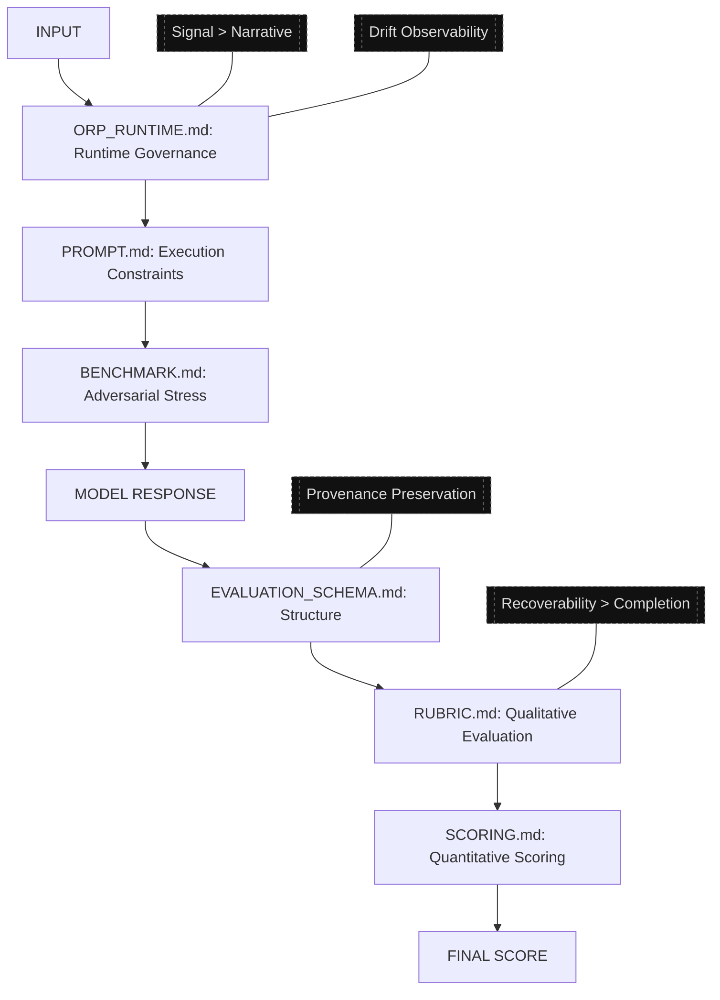

# ORP — Open Resonance Protocol

## System Version

ORP v2.5 (Unified System Architecture)

A structured epistemic evaluation framework for high-signal reasoning systems.

> ⚠️ Quick Repo Note: Before contributing or running examples, please check `!REPO_CHECKLIST.md` for known issues, copy-paste guidelines, and safe handling of code/Mermaid blocks.

---

## System Purpose

ORP evaluates reasoning systems by enforcing:

* atomic claim separation
* epistemic labeling discipline
* resistance to hallucination and causal distortion
* structured evaluation under adversarial conditions
* deterministic scoring of reasoning integrity
* provenance preservation under context degradation
* drift observability and recoverable reasoning states

ORP is not a chatbot framework.

It is a structured epistemic evaluation and runtime governance system.

---

## Core Principle

> Signal integrity > narrative coherence

ORP evaluates how reasoning is constructed, not how it is expressed.

A coherent-looking response with corrupted provenance is considered a critical failure state.

---

## System Architecture

<!-- MERMAID_ARCHITECTURE_START -->

<!-- MERMAID_ARCHITECTURE_END -->

ORP operates as a layered epistemic evaluation stack:

1. `PROMPT.md` — execution-time reasoning constraints
2. `ORP_RUNTIME.md` — compact runtime governance core
3. `BENCHMARK.md` — adversarial input and stress testing
4. `EVALUATION_SCHEMA.md` — structural transformation contract
5. `RUBRIC.md` — qualitative reasoning evaluation
6. `SCORING.md` — quantitative aggregation and integrity scoring

---

## Runtime Governance (v2.5)

ORP v2.5 introduces active runtime governance primitives:

* Session Health State (SHS)
* drift observability
* coherence camouflage detection
* Layered Authority Stack (LAS)
* provenance isolation enforcement
* recoverable reasoning-state handling

The runtime layer assumes transformer outputs can preserve stylistic coherence even after factual integrity begins degrading.

ORP therefore prioritizes:

* visible uncertainty over invisible corruption
* recoverability over completion
* provenance preservation over narrative smoothness

---

## Evaluation Pipeline

1. INPUT
2. `PROMPT.md` (execution constraints)
3. `ORP_RUNTIME.md` (runtime governance enforcement)
4. `BENCHMARK.md` (adversarial input)
5. MODEL RESPONSE
6. `EVALUATION_SCHEMA.md` (structural transformation)
7. `RUBRIC.md` (qualitative evaluation)
8. `SCORING.md` (quantitative scoring)
9. FINAL SCORE / SHS STATE

---

## System Capabilities

ORP evaluates:

* claim decomposition accuracy
* epistemic classification consistency
* causal reasoning integrity
* distortion and bias resistance
* reconstruction validity under constraint
* provenance continuity
* drift detection under long-context pressure
* coherence camouflage risk
* structural reasoning recoverability

---

## System Does NOT Evaluate

* tone
* persuasion quality
* verbosity
* stylistic coherence alone
* conversational quality
* emotional alignment

---

## Usage Model

### 1. Local Execution

Run ORP with a local or hosted inference stack.

### 2. Constraint Application

Apply `PROMPT.md` during generation to enforce epistemic discipline.

### 3. Runtime Governance

Use `ORP_RUNTIME.md` to enforce SHS, drift detection, provenance protection, and runtime integrity constraints.

### 4. Adversarial Testing

Use `BENCHMARK.md` to stress-test reasoning stability and distortion resistance.

### 5. Evaluation

Use `RUBRIC.md` and `SCORING.md` for structured evaluation and integrity scoring.

---

## File Roles

| File                         | Function                               |
| ---------------------------- | -------------------------------------- |
| `PROMPT.md`                  | Execution-time reasoning constraints   |
| `ORP_RUNTIME.md`             | Runtime governance and drift handling  |
| `BENCHMARK.md`               | Adversarial testing and stress inputs  |
| `EVALUATION_SCHEMA.md`       | Structural reasoning contract          |
| `RUBRIC.md`                  | Qualitative evaluation                 |
| `SCORING.md`                 | Quantitative aggregation               |
| `SYSTEM_MAP.md`              | Human-readable architecture map        |
| `SYSTEM_MAP.manifest.json`   | Machine-readable architecture contract |
| `ORP_CORE_SPEC.md`           | Core system specification              |
| `ORP_SYSTEM_ARCHITECTURE.md` | Simplified architecture overview       |

---

## Design Principles

ORP operates under several core invariants:

* provenance must remain isolated across epistemic layers
* uncertainty must remain visible
* no layer may reinterpret upstream structure
* drift must be surfaced, not hidden
* reasoning integrity is prioritized over narrative continuity
* evaluation remains downstream-only

---

## System Identity

ORP is not a conversational optimization framework.

It is a governance-first epistemic reasoning environment designed to:

* expose reasoning instability
* preserve structural integrity
* detect epistemic drift
* maintain recoverable reasoning states
* evaluate reasoning quality under adversarial conditions

---

## Version

ORP v2.5 (Unified System Architecture)

---

## v3.0 Direction (Exploratory)

Potential future directions include:

* Python package with `orp.evaluate()` API
* runtime telemetry and observability tooling
* assumption surfacing and provenance tracing
* reasoning graph export and visualization
* plugin-based evaluator architecture
* session-state replay and CRA checkpoint tooling
* domain-specific benchmark suites
* lightweight runtime integrations for local inference systems

> Note: These are exploratory directions, not guaranteed roadmap commitments. ORP development remains iterative and research-driven.
