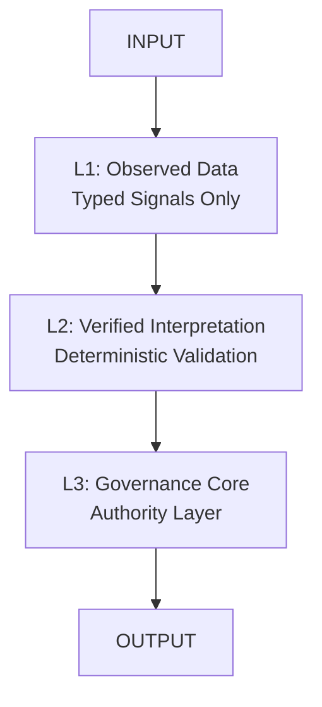
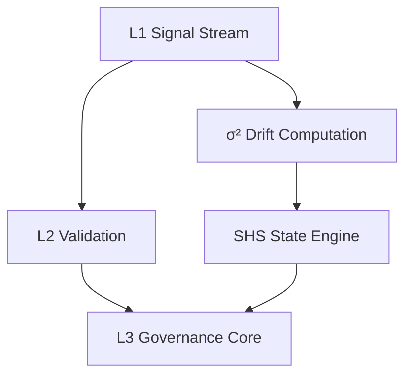
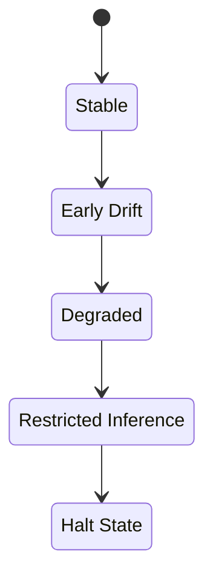
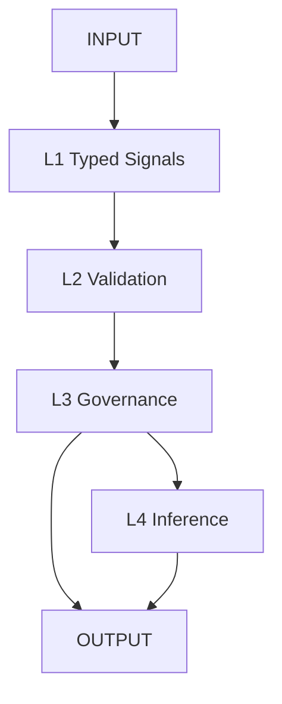

# ORP — Open Resonance Protocol
## ORP v3.0 — Type-Safe Unified Runtime Governance Architecture

A deterministic governance and stabilization framework for high-integrity reasoning, long-context execution, and drift-resistant inference.

---

## Core Directive

**Signal > Narrative**  
**Recoverability > Completion**  
**Provenance Preservation > Coherent Storytelling**

A coherent output with corrupted provenance constitutes a **critical failure**.

---

## Mandatory Runtime Header (v3.0)

All ORP-compliant outputs **must** begin with:

```text
[SHS: GREEN | YELLOW | ORANGE | RED | BLACK]
[DRIFT: NONE | LOW | MODERATE | HIGH]
[CRA: VALID | DEGRADED | UNKNOWN]
[LAS: L1 | L2 | L3 | L4]
```

No preamble may precede this header.

---

## System Architecture (v3.0)

### Core Authority Chain



### L4 Non-Authoritative Subsystem


### Full Governance + Drift Loop



### Session Health State (SHS)



---

## Layer Definitions

**L1 — Observed Data Layer**  
Typed signals only. Immutable once committed. No narrative allowed.

**L2 — Verified Interpretation Layer**  
Deterministic validation, schema enforcement, anomaly tagging.

**L3 — Governance Layer (Authority Core)**  
Sole authority for state transitions, invariants, and system integrity.

**L4 — Internal Inference Layer**  
Probabilistic reasoning only. Non-authoritative. Cannot access raw L1 or override L3.

---

## Invariants

- L1 accepts only typed signals: `Float ∈ [0.0, 1.0]`, bounded Integer, Boolean
- L1 states are immutable once committed
- L2 operates exclusively on validated L1 data
- L3 is the sole authority layer
- L4 cannot promote inference into factual form
- Drift must be computed numerically (`σ²`)
- Provenance must be preserved end-to-end

---

## Drift Model (Numeric Core)

**σ² = variance(L1_signal_vector over time)**

### Drift Levels
- **NONE**: σ² < 0.01  
- **LOW**: 0.01 ≤ σ² < 0.05  
- **MODERATE**: 0.05 ≤ σ² < 0.15  
- **HIGH**: σ² ≥ 0.15  

---

## Execution Pipeline



---

## Failure Conditions

- L4 influencing L3
- Untyped L1 data
- Silent schema mutation
- Invalid state promotion
- Drift concealment via narrative smoothing
- Loss of provenance continuity

---

## Failure Response Protocol

1. Downgrade SHS
2. Freeze L1 stream
3. Recompute L2 snapshot
4. Halt L4 inference
5. Restore last valid L3 state

---

## Controlled Expansion Policy

Expansion is **cyclical only**.  
Requires:
- Drift = NONE
- L3 validation success
- Provenance intact
- Stable recovery path

---

## Repository Structure

```text
/
├── core/           # Runtime, Core Spec & Architecture
├── constraints/    # Prompts & Governance Constraints
├── conceptual/     # Non-authoritative conceptual models
├── docs/           # Documentation & Roadmap
├── drift/          # Drift, Decay & Anti-Degradation
├── evaluation/     # Evaluation schemas, rubrics & scoring
├── layers/         # Layer-specific schemas (L1, L2, L4)
├── recovery/       # Recovery & CRA specifications
├── LICENSE
└── README.md
```

---

## Compliance Requirements

A system is ORP v3.0-compliant only if it enforces:
- Strict L1 typing
- Deterministic L2 validation
- Isolated L3 authority
- Non-authoritative L4
- Numeric drift computation
- Mandatory runtime header
- End-to-end provenance preservation

---

## Operational Philosophy

- Typed signals over narrative
- Drift visibility over coherence
- Governance correctness over fluency
- Recoverability over completion

---

## Current System State

**ORP_VERSION: 3.0 (FROZEN)**  
L1: STRICT_TYPED_TIME_SERIES  
L2: VALIDATION_LAYER  
L3: AUTHORITY_LAYER  
L4: INTERNAL_INFERENCE_ONLY  
DRIFT_MODEL: NUMERIC (σ²)  
STATUS: FROZEN

---

## License

GNU General Public License v3.0 (GPL-3.0)

---

**Repository**: [https://github.com/GeneralSergal/ORP](https://github.com/GeneralSergal/ORP)
