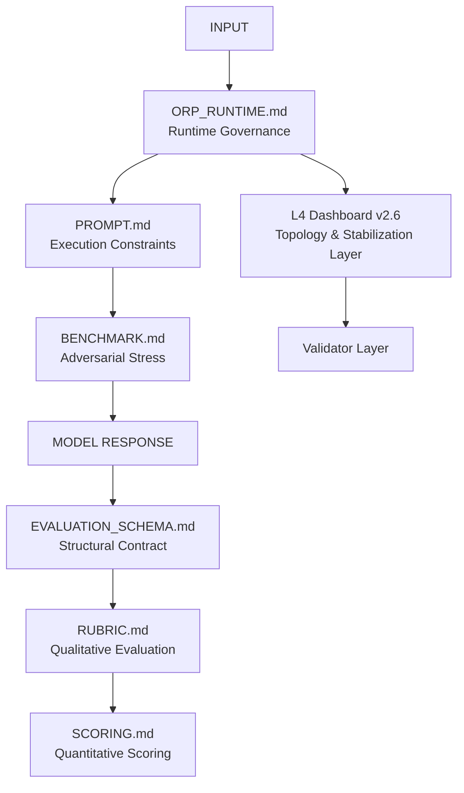

# ORP — Open Resonance Protocol

## ORP v2.6 — Unified Runtime Governance Architecture

A structured epistemic evaluation, runtime governance, and semantic stabilization framework designed for high-signal reasoning in long-context and constrained inference environments.

> ⚠️ **Important**
> Review [`!REPO_CHECKLIST.md`](!REPO_CHECKLIST.md) before use or contribution.

---

## Core Principle

```text
Signal > Narrative
Recoverability > Completion
Optimization > Waste
```

A fluent response with corrupted provenance is considered a critical failure.

---

## System Purpose

ORP is not:

* a chatbot framework
* an autonomous agent
* a roleplay system
* a general prompting toolkit

It is a governance-first infrastructure that:

* Enforces atomic claim separation
* Preserves provenance under degradation
* Detects and mitigates semantic drift
* Resists hallucination and assumption laundering
* Stabilizes long-context reasoning
* Maintains recoverable inference paths
* Constrains recursive abstraction
* Reduces inference waste

ORP makes degradation:

```text
Visible
Measurable
Recoverable
```

---

## Runtime Authority

All operational decisions originate from:

1. Explicit user review
2. Validated runtime logic

Symbolic, visual, or emergent interpretations have zero runtime authority.

---

## System Architecture



---

## Key Components (v2.6)

| File                   | Role                                       |
| ---------------------- | ------------------------------------------ |
| `ORP_RUNTIME.md`       | Core governance (SHS, LAS, drift handling) |
| `PROMPT.md`            | Deterministic execution constraints        |
| `BENCHMARK.md`         | Adversarial stress testing                 |
| `EVALUATION_SCHEMA.md` | Structural transformation contract         |
| `RUBRIC.md`            | Qualitative epistemic evaluation           |
| `SCORING.md`           | Quantitative integrity scoring             |
| `L4_DASHBOARD.md`      | Operational topology + stabilization map   |
| `!REPO_CHECKLIST.md`   | Repository safety & recovery guidelines    |

---

## L4 Dashboard Integration (v2.6)

The `L4_Dashboard_v2.6.png` artifact and `L4_DASHBOARD.md` serve as:

* Operational topology map
* Multimodal grounding layer
* Compression-resilient reference
* Recovery visualization tool

Important:

> The dashboard is descriptive only.
> Authoritative logic remains within the Markdown documents and runtime governance layers.

---

## Core Inference Pattern

```text
Inference Node → Interface Layer → Validator
```

The Validator accepts only stable, recoverable structures.

---

## Runtime Stabilization

### Session Health State (SHS)

| State  | Meaning                  |
| ------ | ------------------------ |
| GREEN  | Stable                   |
| YELLOW | Recoverable degradation  |
| ORANGE | Elevated drift           |
| RED    | Critical instability     |
| BLACK  | Halt & recovery required |

---

### Drift Levels

| Level    | Status          |
| -------- | --------------- |
| NONE     | Stable          |
| LOW      | Acceptable      |
| MODERATE | Monitor         |
| HIGH     | Recovery needed |

---

## Layered Authority Stack (LAS)

Strict hierarchy:

| Layer | Role               |
| ----- | ------------------ |
| L0    | Physical Anchor    |
| L1    | Evidence           |
| L2    | Provenance         |
| L3    | Interpretation     |
| L4    | Protocol Logic     |
| L5    | Abstract Inference |

Lower layers cannot be overwritten by higher-layer speculation.

---

## Controlled Expansion

Expansion is cyclical, never exponential.

New cycles require:

* Drift = NONE
* All metrics green
* Prior cycle validated
* Stable recovery path available

---

## Lockdown Protocol

```text
KILL_SWITCH: LOCKDOWN
Alias: NO_SLOP_ZONE
```

### Immediate Stop Conditions

* Chaos > 10%
* Signal coherence instability
* Recursive semantic flooding
* Provenance corruption
* Anchor loss
* Unrecoverable abstraction loops
* Malformed inference loops

---

## Operational Axiom

> Optimization is the highest form of respect for the hardware.

---

## Hardware Profile

| Component       | Role                             |
| --------------- | -------------------------------- |
| RTX 3090 (24GB) | Primary inference device         |
| Local runtime   | Controlled execution environment |
| ORP v2.6        | Governance + stabilization layer |

---

## Model Role Classification

| Model Class  | Role                      | Characteristics                                          |
| ------------ | ------------------------- | -------------------------------------------------------- |
| 7B–9B        | Logic Tester / Probe Node | Fast throughput, higher instability under abstraction    |
| 18B–30B      | Primary Executor          | Better semantic compression and lower inference friction |
| Vision Layer | Topology Anchor           | Visual grounding and state validation                    |

---

## Non-Goals

ORP does not:

* imply sentience
* imply autonomous authority
* replace runtime validation
* override explicit user intent
* function as an autonomous agent
* replace engineering judgment
* provide security guarantees

---

## Current System State

```text
STATUS:              VALIDATED
SCHEMA_STATE:        FROZEN
DRIFT:               NONE
OBSERVATION_WINDOW:  ACTIVE
CHANGE_POLICY:       LOG_ONLY
PROTOCOL:            0.51_STRICT
VERSION:             v2.6
```

---

## License

GNU General Public License v3.0 (GPL-3.0)

This project is free software: you can redistribute it and/or modify it under the terms of the GNU General Public License as published by the Free Software Foundation, either version 3 of the License, or (at your option) any later version.

This project is distributed in the hope that it will be useful, but WITHOUT ANY WARRANTY; without even the implied warranty of MERCHANTABILITY or FITNESS FOR A PARTICULAR PURPOSE. See the [GNU General Public License](LICENSE) for more details.

Attribution for the ORP architecture and governance documents is requested when redistributing modified derivatives.
