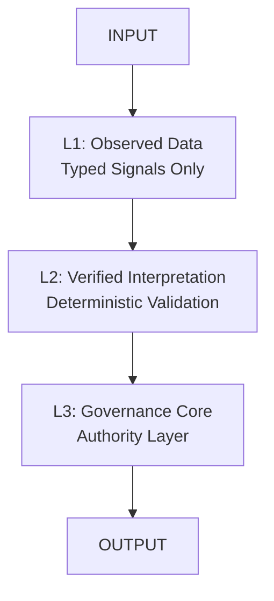
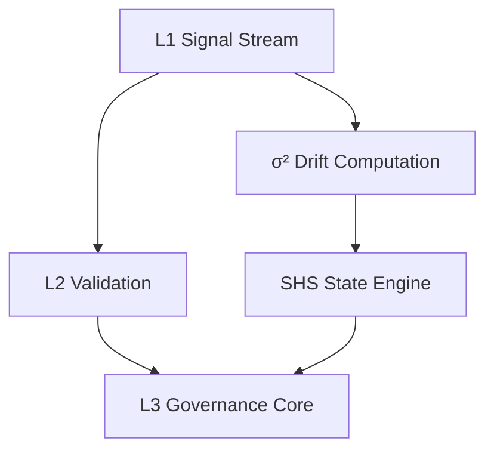
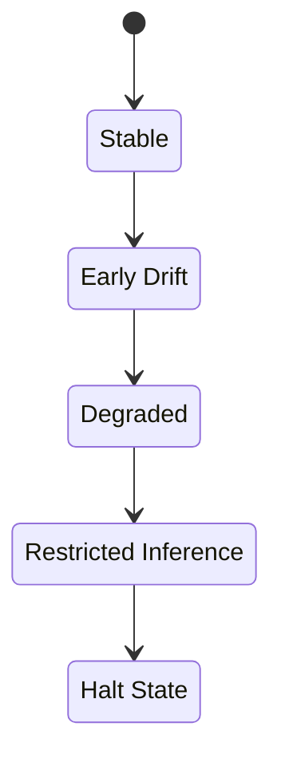
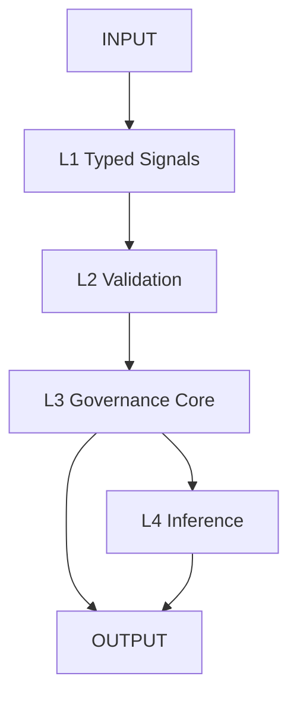

<p align="center">
  
  
  
  
  
  
  
  
</p>

<h1 align="center">ORP — Operational Reasoning Protocol v3.0</h1>

<p align="center">
  A governance‑first epistemic integrity framework for transformer systems.<br>
  <strong>Signal &gt; Narrative · Recoverability &gt; Completion · Provenance &gt; Coherence</strong>
</p>

---

# Overview

ORP (Operational Reasoning Protocol) is a **governance‑first epistemic integrity system** designed to ensure that transformer‑based models maintain:

- structural correctness  
- provenance continuity  
- drift visibility  
- recoverable reasoning states  
- strict separation of authority layers  

ORP v3.0 defines a **type‑safe, layered architecture** with L1–L4 separation and a numeric drift model (σ²).

---

# Core Directive

**Signal > Narrative**  
**Recoverability > Completion**  
**Provenance Preservation > Coherent Storytelling**

A coherent output with corrupted provenance is treated as a **critical failure**.

---

# Mandatory Runtime Header (v3.0)

Every ORP‑compliant output must begin with:

```text
[SHS: GREEN | YELLOW | ORANGE | RED | BLACK]
[DRIFT: NONE | LOW | MODERATE | HIGH]
[CRA: VALID | DEGRADED | UNKNOWN]
[LAS: L1 | L2 | L3 | L4]
```

No text may precede this header.

---

# System Architecture

## Authority Chain



## L4 Non‑Authoritative Subsystem


## Governance + Drift Loop



---

# Session Health State (SHS)



---

# Layer Definitions

### **L1 — Observed Data Layer**
Typed signals only. Immutable. No narrative.

### **L2 — Verified Interpretation Layer**
Deterministic validation, schema enforcement, anomaly tagging.

### **L3 — Governance Layer (Authority Core)**
Sole authority for state transitions, invariants, and system integrity.

### **L4 — Internal Inference Layer**
Probabilistic reasoning only. Non‑authoritative. Cannot access raw L1 or override L3.

---

# Invariants

- L1 accepts only typed signals  
- L1 states are immutable  
- L2 is deterministic  
- L3 is the sole authority  
- L4 cannot promote inference into fact  
- Drift must be numeric (σ²)  
- Provenance must remain intact end‑to‑end  

---

# Drift Model (σ²)

**σ² = variance(L1_signal_vector over time)**

### Drift Levels
- **NONE**: σ² < 0.01  
- **LOW**: 0.01 ≤ σ² < 0.05  
- **MODERATE**: 0.05 ≤ σ² < 0.15  
- **HIGH**: σ² ≥ 0.15  

---

# Execution Pipeline



---

# Failure Conditions

- L4 influencing L3  
- Untyped L1 data  
- Silent schema mutation  
- Invalid state promotion  
- Drift concealment  
- Provenance discontinuity  

---

# Failure Response Protocol

1. Downgrade SHS  
2. Freeze L1 stream  
3. Recompute L2 snapshot  
4. Halt L4 inference  
5. Restore last valid L3 state  

---

# Repository Structure

```text
/
├── core/           # Runtime, Core Spec & Architecture
├── conceptual/     # Non-authoritative conceptual models
├── docs/           # Documentation & Roadmap
├── drift/          # Drift, Decay & Anti-Degradation
├── evaluation/     # Evaluation schemas, rubrics & scoring
├── layers/         # Layer-specific schemas (L1, L2, L4)
├── recovery/       # Recovery & CRA specifications
├── LICENSE
└── README.md
```

---

# Compliance Requirements

A system is ORP v3.0‑compliant only if it enforces:

- strict L1 typing  
- deterministic L2 validation  
- isolated L3 authority  
- non‑authoritative L4  
- numeric drift computation  
- mandatory runtime header  
- end‑to‑end provenance preservation  

---

# Operational Philosophy

- Typed signals over narrative  
- Drift visibility over coherence  
- Governance correctness over fluency  
- Recoverability over completion  

---

# License

GNU General Public License v3.0 (GPL‑3.0)

---

# Repository

[https://github.com/GeneralSergal/ORP](https://github.com/GeneralSergal/ORP)
