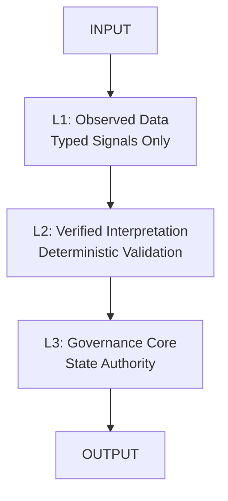
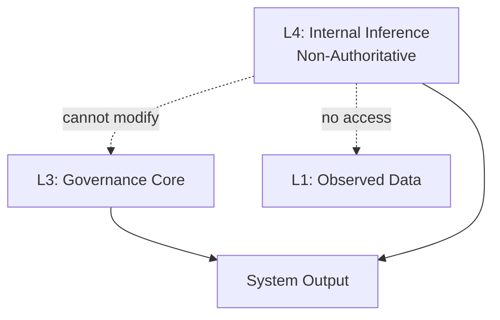
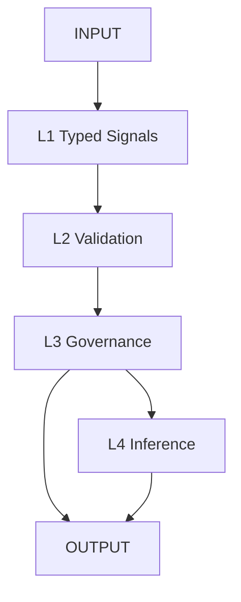
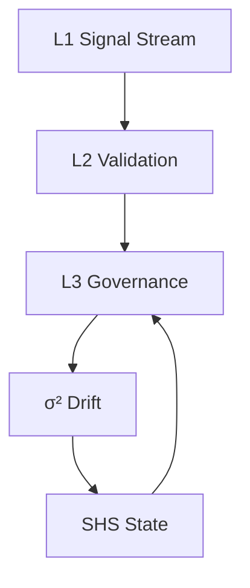
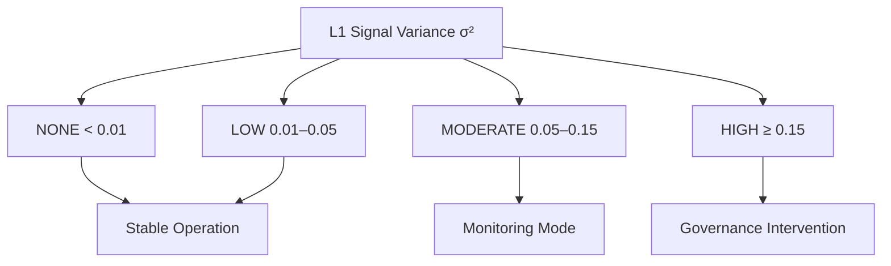
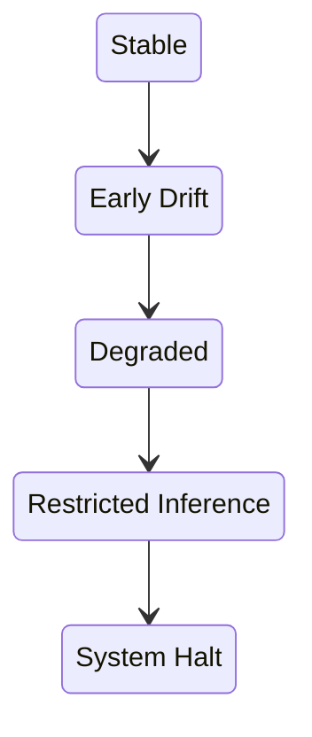
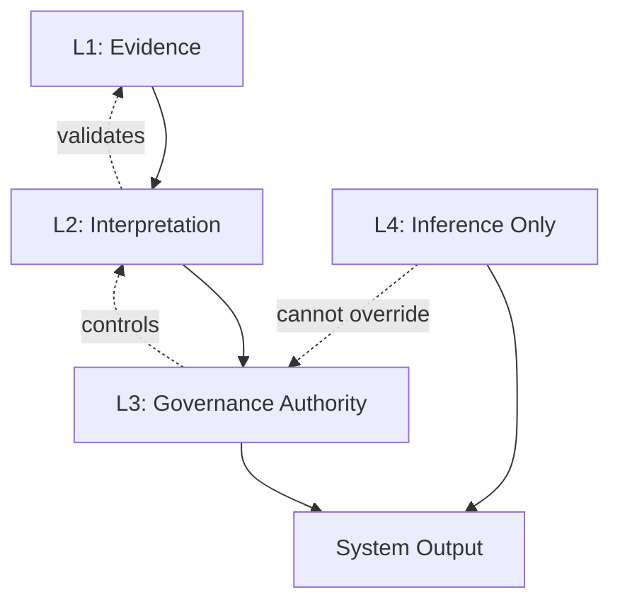

# ORP — Open Resonance Protocol
## ORP v3.0 — Type-Safe Unified Runtime Governance Architecture

A deterministic governance and stabilization framework for high-integrity reasoning, long-context execution, and drift-resistant inference.

---

## Core Directive

**Signal > Narrative**  
**Recoverability > Completion**  
**Provenance Preservation > Coherent Storytelling**

A coherent output with corrupted provenance constitutes a **critical failure**.

---

## Mandatory Runtime Header (v3.0)

All ORP-compliant outputs **must** begin with:

```text
[SHS: GREEN | YELLOW | ORANGE | RED | BLACK]
[DRIFT: NONE | LOW | MODERATE | HIGH]
[CRA: VALID | DEGRADED | UNKNOWN]
[LAS: L1 | L2 | L3 | L4]
```

No preamble may precede the header.

---

## System Architecture (v3.0)

### Core Authority Chain (L1 → L2 → L3)



### Layer Definitions

- **L1 — Observed Data Layer**  
  Typed telemetry only. No strings. No narrative. Immutable time-indexed vectors.

- **L2 — Verified Interpretation Layer**  
  Deterministic validation of L1. Schema enforcement, anomaly tagging, consistency checks.

- **L3 — Governance Layer (Authority Core)**  
  Sole authority for state transitions, invariants, and conflict resolution. L4 cannot influence L3.

- **L4 — Internal Inference Subsystem**  
  Probabilistic interpretation only. No truth authority. Cannot access raw L1 or modify L2/L3.

---

## L4 Non-Authoritative Side-Channel



---

## Invariants

- L1 accepts only typed signals: `Float ∈ [0.0,1.0]`, bounded Integer, Boolean
- L1 states are immutable once committed
- L2 operates exclusively on validated L1 data
- L3 is the sole authority layer
- L4 cannot promote inference into factual form
- Provenance must be preserved across L1→L2 transitions
- Drift must be computed numerically and deterministically
- No external dependencies in runtime governance

---

## Drift Model (Numeric Core)

**σ² = variance(L1_signal_vector over time)**

### Drift Levels
- **NONE**: σ² < 0.01  
- **LOW**: 0.01 ≤ σ² < 0.05  
- **MODERATE**: 0.05 ≤ σ² < 0.15  
- **HIGH**: σ² ≥ 0.15  

Supporting signals: hash(L1→L2 transition delta), temporal stability gradient.

---

## Execution Pipeline



---

## Failure Conditions & Response

**Failure Conditions:**
- L4 influencing L3
- Untyped L1 data
- Silent schema mutation
- Invalid state promotion
- Drift concealment via narrative smoothing

**Response Protocol:**
1. Downgrade SHS
2. Freeze L1 stream
3. Recompute L2 snapshot
4. Halt L4 inference
5. Restore last valid L3 state

---

## Controlled Expansion

Expansion is **cyclical only**.  
Requires: Drift = NONE, L3 validation success, intact provenance, and stable recovery path.

---

## Repository Structure (v3.0)

```
/README.md
/ORP_VERSION
/LICENSE

/core/
    ORP_RUNTIME.md
    ORP_CORE_SPEC.md
    ORP_SYSTEM_ARCHITECTURE.md
    ORP_ARCHITECTURE.md
    ...

/constraints/
    ORP_PROMPT.md
    ORP_ANTI_DEGRADATION.md
    ORP_MODEL_DECAY_TRACKER.md

/observability/
    ORP_SIGMA_SQUARED_DRIFT.md

/evaluation/
    ORP_BENCHMARK.md
    ORP_EVALUATION_SCHEMA.md
    ...

/docs/
    ORP_ROADMAP.md
    !REPO_CHECKLIST.md
    ...
```

---

## Compliance Requirements

A system is ORP v3.0-compliant only if it enforces:
- Strict L1 typing
- Deterministic L2 validation
- Isolated L3 authority
- Numeric drift computation
- Mandatory header
- End-to-end provenance preservation

---

## Operational Philosophy

- Typed signals over narrative
- Drift visibility over coherence
- Governance correctness over fluency
- Recoverability over completion

---

## Current System State

**ORP_VERSION: 3.0 (FROZEN)**  
L1: STRICT_TYPED_TIME_SERIES  
L2: VALIDATION_LAYER  
L3: AUTHORITY_LAYER  
L4: INTERNAL_INFERENCE_ONLY  
DRIFT_MODEL: NUMERIC  
STATUS: FROZEN

---

## License

GNU General Public License v3.0 (GPL-3.0)

---

## Supplemental Diagrams

<details>
<summary><strong>Full Governance + Drift Control Loop</strong></summary>


</details>

<details>
<summary><strong>Drift Classification Model</strong></summary>


</details>

<details>
<summary><strong>Session Health State (SHS) Chain</strong></summary>


</details>

<details>
<summary><strong>Layered Authority Stack (LAS)</strong></summary>


</details>

---

**Repository**: [https://github.com/GeneralSergal/ORP](https://github.com/GeneralSergal/ORP)

ORP v3.0 is **frozen** and actively maintained.
