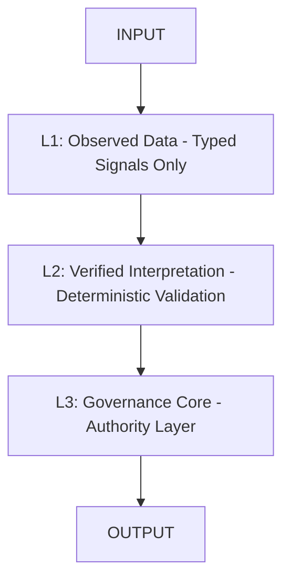
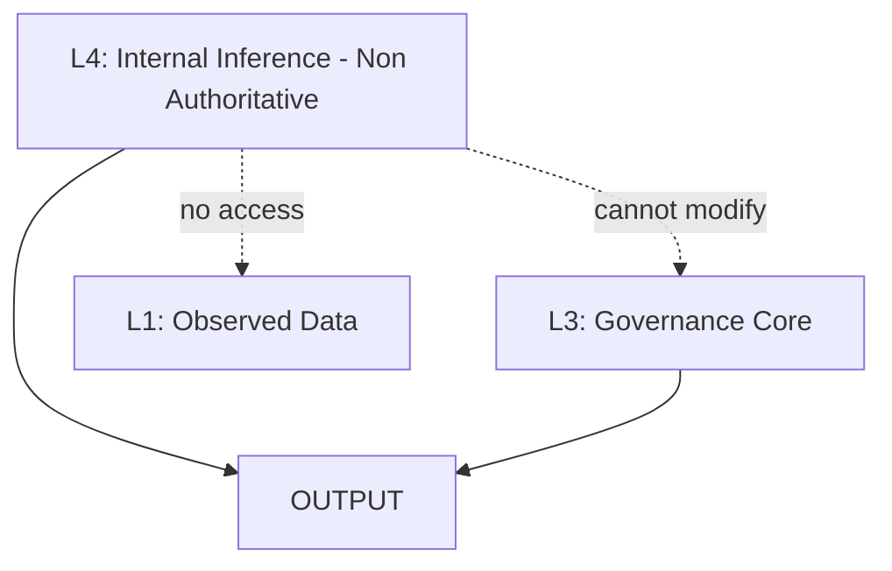
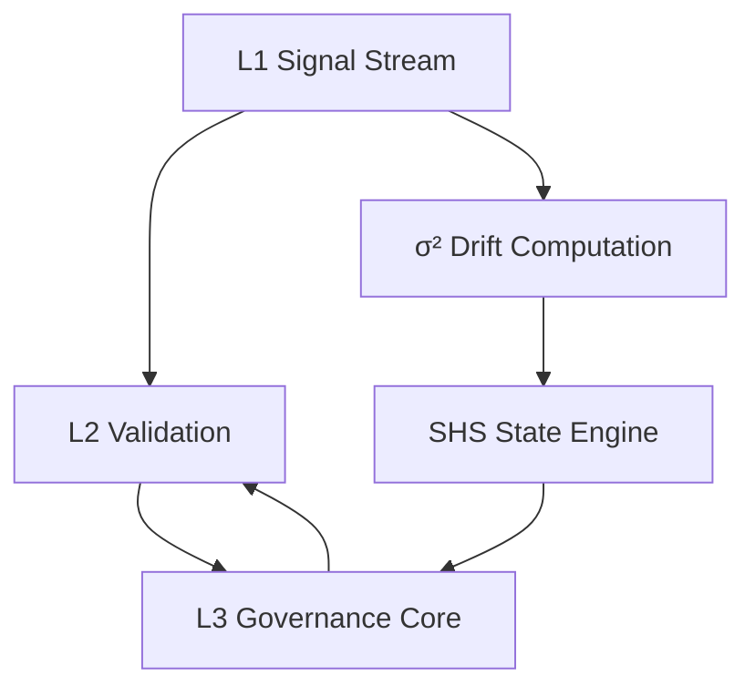
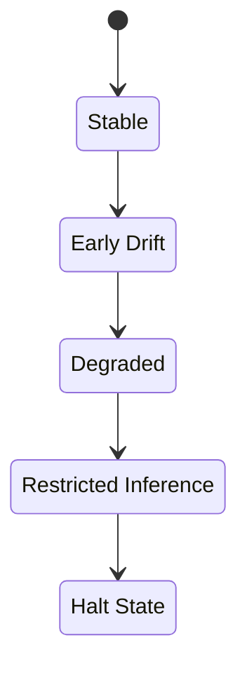
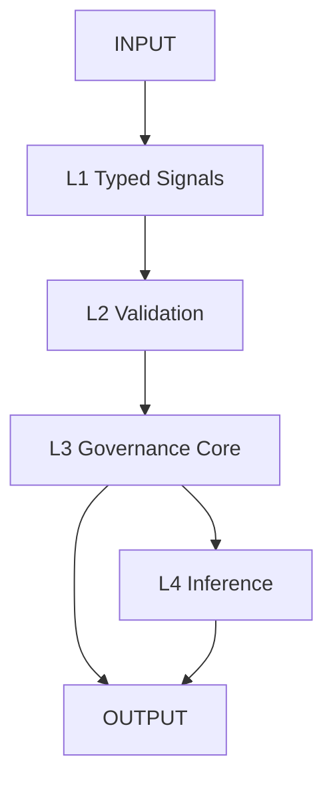

# ORP — Open Resonance Protocol  
## ORP v3.0 — Type-Safe Unified Runtime Governance Architecture

A deterministic governance and stabilization framework for high-integrity reasoning, long-context execution, and drift-resistant inference.

---

# Core Directive

Signal > Narrative  
Recoverability > Completion  
Provenance Preservation > Coherent Storytelling  

A coherent output with corrupted provenance constitutes a **critical failure**.

---

# Mandatory Runtime Header (v3.0)

All ORP-compliant outputs **must** begin with:

```text
[SHS: GREEN | YELLOW | ORANGE | RED | BLACK]
[DRIFT: NONE | LOW | MODERATE | HIGH]
[CRA: VALID | DEGRADED | UNKNOWN]
[LAS: L1 | L2 | L3 | L4]
```

No preamble may precede this header.

---

# System Architecture (v3.0)

## Core Authority Chain



---

## L4 Non-Authoritative Subsystem



---

## Full Governance + Drift Loop



---

## SHS (Session Health State)




---

# Layer Definitions

## L1 — Observed Data Layer
* Typed signals only  
* Immutable once committed  
* No narrative content allowed  

## L2 — Verified Interpretation Layer
* Deterministic validation of L1  
* Consistency and schema enforcement  
* No speculative reasoning  

## L3 — Governance Layer (Authority Core)
* Sole state authority  
* Handles transitions and invariants  
* Controls SHS and system integrity  

## L4 — Internal Inference Layer
* Probabilistic reasoning only  
* Non-authoritative  
* Cannot access raw L1 or override L3  

---

# Invariants

* L1 accepts only typed signals:
  * Float ∈ [0.0, 1.0]
  * Integer (bounded domain required)
  * Boolean ∈ {0,1}

* L1 is immutable after commit  
* L2 operates strictly on validated L1  
* L3 is the only authority layer  
* L4 cannot modify L1/L2/L3  
* L4 cannot be promoted into authoritative state  
* Drift must be numerically computed (σ²)  
* Provenance must be preserved end-to-end  

---

# Drift Model (σ² Core)

σ² = variance(L1_signal_vector over time)

## Drift Levels

* NONE: σ² < 0.01  
* LOW: 0.01 ≤ σ² < 0.05  
* MODERATE: 0.05 ≤ σ² < 0.15  
* HIGH: σ² ≥ 0.15  

---

# Execution Pipeline



---

# Failure Conditions

* L4 influencing L3  
* Untyped L1 data  
* Silent schema mutation  
* Invalid state promotion  
* Drift concealment via narrative smoothing  
* Loss of provenance continuity  

---

# Failure Response Protocol

1. Downgrade SHS  
2. Freeze L1 stream  
3. Recompute L2 snapshot  
4. Halt L4 inference  
5. Restore last valid L3 state  

---

# Controlled Expansion Policy

Expansion is cyclical only.

Requires:

* Drift = NONE  
* L3 validation success  
* Provenance intact  
* Stable recovery path  

---

# Repository Structure

```
/core/
    ORP_RUNTIME.md
    ORP_CORE_SPEC.md
    ORP_SYSTEM_ARCHITECTURE.md
    ORP_SYSTEM_MAP.md
    ORP_SYSTEM_MAP.manifest.json
    ORP_ORIGIN.md
    ORP_COHERENCE_CAMOUFLAGE.md
    ORP_EPISTEMIC_ISOLATION.md
    ORP_META_MAP.md
    ORP_SHS_TRANSITION_TRIGGERS.md

/constraints/
    ORP_PROMPT.md
    ORP_ANTI_DEGRADATION.md
    ORP_MODEL_DECAY_TRACKER.md

/observability/
    ORP_SIGMA_SQUARED_DRIFT.md

/evaluation/
    ORP_BENCHMARK.md
    ORP_EVALUATION_SCHEMA.md
    ORP_RUBRIC.md
    ORP_SCORING.md

/docs/
    !REPO_CHECKLIST.md
    CHANGELOG.md
    CODE_OF_CONDUCT.md
    CONTRACT_BRIDGE.md
    CONTRIBUTING.md
    NOTICE
    ORP_ROADMAP.md
    RELEASE_NOTES.md
```

---

# Compliance Requirements

A system is ORP v3.0-compliant only if:

* L1 enforces strict typing  
* L2 performs deterministic validation  
* L3 is isolated as sole authority layer  
* L4 remains non-authoritative  
* σ² drift is measurable and enforced  
* Mandatory header is emitted first  
* Provenance is preserved end-to-end  

---

# Operational Philosophy

Typed signals over narrative  
Drift visibility over coherence  
Governance correctness over fluency  
Recoverability over completion  

---

# System State

**ORP_VERSION: 3.0 (FROZEN)**  
L1: STRICT_TYPED_TIME_SERIES  
L2: VALIDATION_LAYER  
L3: AUTHORITY_LAYER  
L4: INTERNAL_INFERENCE_ONLY  
DRIFT_MODEL: NUMERIC (σ²)  
CHANGE_POLICY: LOG_ONLY  
STATUS: FROZEN  

---

# License

GNU General Public License v3.0 (GPL-3.0)
