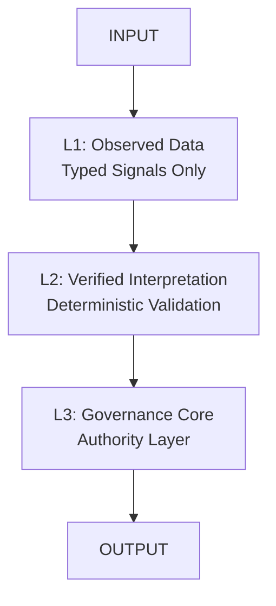
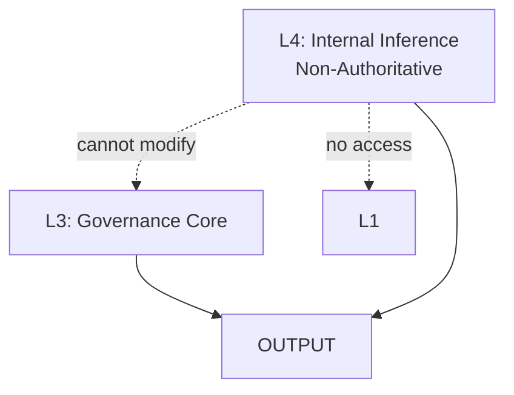
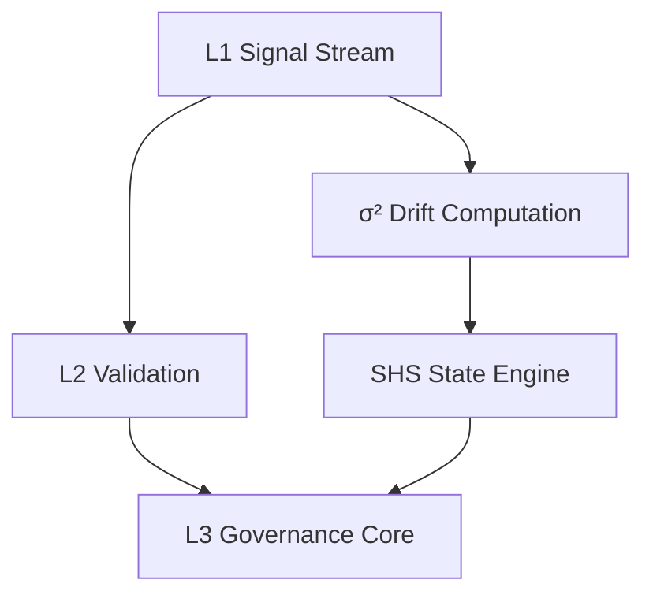
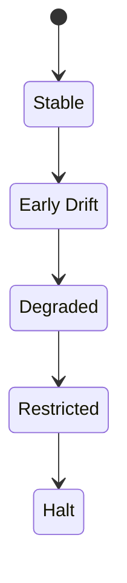
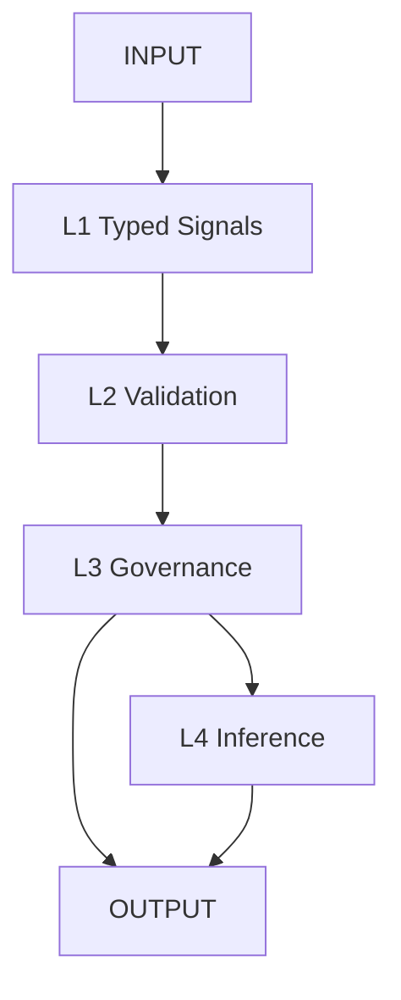

<p align="center">
  
  
  
  
  
  
  
  
</p>

<h1 align="center">ORP — Open Resonance Protocol v3.0</h1>

<p align="center">
  A governance-first epistemic integrity framework.<br>
  <strong>Signal > Narrative · Recoverability > Completion · Provenance > Coherence</strong>
</p>

<p align="center">
  <a href="https://generalsergal.github.io/ORP/">🔗 Live Website</a> ·
  <a href="https://github.com/GeneralSergal/ORP/releases">📦 Releases</a> ·
  <a href="https://github.com/GeneralSergal/ORP/blob/main/CHANGELOG.md">🧾 Changelog</a>
</p>

---

# Overview

ORP v3.0 is a **governance-first epistemic integrity framework** engineered for real-world LLM environments. It provides:

- Structural correctness and provenance continuity  
- Numeric drift visibility (`σ²`)  
- Recoverable reasoning states  
- Strict L1–L4 authority separation  
- Multiple runtime variants adapted to different model capabilities

A coherent output with corrupted provenance constitutes a **critical failure**.

---

# Runtime Variants

ORP is not a single prompt — it is a **family of execution policies**.

See: [`docs/ORP_RUNTIME_VARIANTS.md`](docs/ORP_RUNTIME_VARIANTS.md)

---

# Mandatory Runtime Header (v3.0)

All ORP-compliant outputs **must** begin with:

```text
[SHS: GREEN | YELLOW | ORANGE | RED | BLACK]
[DRIFT: NONE | LOW | MODERATE | HIGH]
[CRA: VALID | DEGRADED | UNKNOWN]
[LAS: L1 | L2 | L3 | L4]
```

---

# System Architecture

## Core Authority Chain

<details>
<summary>Core Authority Chain</summary>


</details>

## L4 Non-Authoritative Subsystem

<details>
<summary>L4 Non-Authoritative Subsystem</summary>


</details>

## Governance + Drift Loop

<details>
<summary>Governance + Drift Loop</summary>


</details>

## Session Health State (SHS)

<details>
<summary>Session Health State (SHS)</summary>


</details>

---

## Execution Pipeline

<details>
<summary>Execution Pipeline Diagram</summary>


</details>

---

# Layer Definitions

- **L1** — Observed Data Layer (Typed signals only, immutable)  
- **L2** — Verified Interpretation Layer (Deterministic validation)  
- **L3** — Governance Layer (Sole authority)  
- **L4** — Internal Inference Layer (Non-authoritative)

---

# Design Philosophy

See: [`docs/ORP_DESIGN_PHILOSOPHY.md`](docs/ORP_DESIGN_PHILOSOPHY.md)

> **Optimization is the highest form of respect for the hardware.**

---

# Drift Model (Numeric)

**σ² = variance(L1_signal_vector over time)**

- **NONE**: σ
² < 0.01  
- **LOW**: 0.01 ≤ σ² < 0.05  
- **MODERATE**: 0.05 ≤ σ² < 0.15  
- **HIGH**: σ² ≥ 0.15  

---

# Repository Structure

```text
/core/           # Core runtime specifications
/docs/           # Documentation & philosophy
/drift/          # Drift & decay tracking
/evaluation/     # Evaluation schemas
/layers/         # Layer definitions
/recovery/       # Recovery systems
/conceptual/     # Conceptual models
```

---

# Compliance Requirements

A system is ORP v3.0-compliant only if it enforces strict L1 typing, deterministic L2 validation, isolated L3 authority, non-authoritative L4, numeric drift computation, mandatory header, and end-to-end provenance preservation.

---

# Operational Philosophy

- Typed signals over narrative  
- Drift visibility over coherence  
- Governance correctness over fluency  
- Recoverability over completion  

---

# Current System State

**ORP_VERSION: 3.0 (FROZEN)**  
**STATUS: ACTIVE**

---

# License

GNU General Public License v3.0 (GPL-3.0)

---

**Repository**: [https://github.com/GeneralSergal/ORP](https://github.com/GeneralSergal/ORP)  
**Website**: [https://generalsergal.github.io/ORP/](https://generalsergal.github.io/ORP/)
