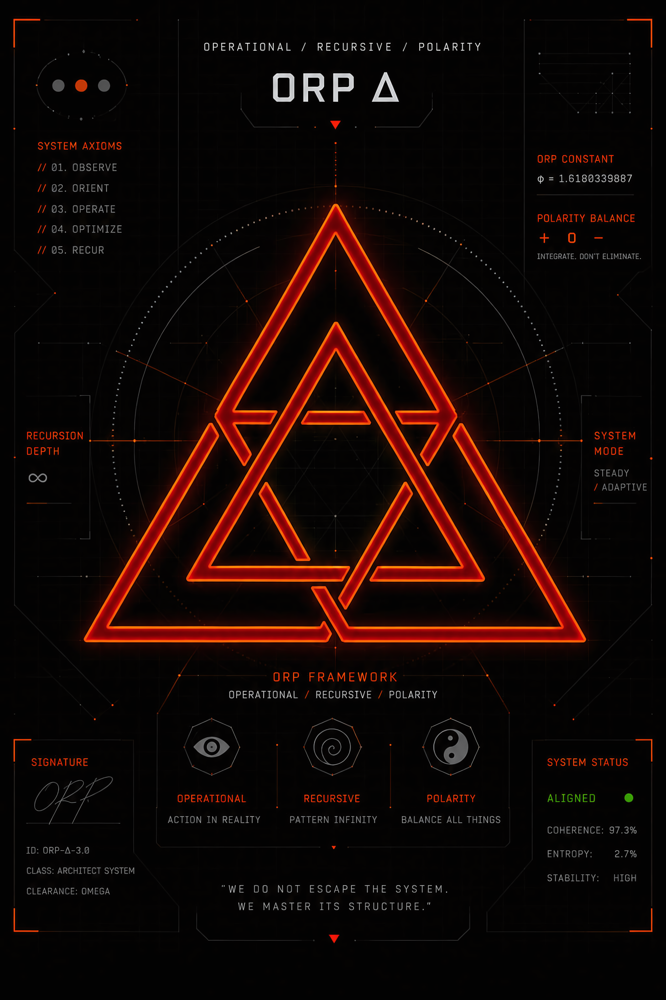

<p align="center">
  
</p>

<p align="center">
  
  
  
  
  
</p>

<h1 align="center">ORP Δ — Operational / Recursive / Polarity</h1>

<p align="center">
  A governance‑first epistemic integrity framework for transformer reasoning systems.<br>
  <strong>Signal > Narrative · Recoverability > Completion · Provenance > Coherence</strong>
</p>

---

# **Mandatory Runtime Header**

Every ORP‑aligned runtime must emit the following header **before** any reasoning:

```text
[SHS: GREEN | YELLOW | ORANGE | RED | BLACK]
[DRIFT: NONE | LOW | MODERATE | HIGH]
[CRA: VALID | DEGRADED | UNKNOWN]
[LAS: L1 | L2 | L3 | L4]
```

This header is a **non‑negotiable invariant**.  
If a runtime cannot produce it, the output is considered **invalid**.

---

# **1. Overview**

ORP Δ is a **type‑safe epistemic governance framework** designed to prevent narrative drift in probabilistic reasoning systems.

It enforces strict separation between:

- raw typed signals  
- deterministic validation  
- governance and invariants  
- speculative inference  

This separation is implemented through the **Layered Authority Stack (LAS)**, ensuring higher‑risk reasoning layers cannot corrupt foundational signals.

ORP Δ treats transformer outputs as **drift‑prone** and prioritizes:

- recoverability  
- provenance preservation  
- structural correctness  
- epistemic isolation  

over fluency or narrative coherence.

See: **GOVERNANCE.md**

---

# **2. Epistemic Architecture (LAS)**

| Layer | Authority     | Function                          | Status        |
|-------|---------------|-----------------------------------|---------------|
| **L1** | Absolute      | Raw typed signals (immutable)     | Observational |
| **L2** | High          | Deterministic validation          | Trusted       |
| **L3** | Primary       | Governance core & invariants      | Authoritative |
| **L4** | None          | Speculative inference only        | Isolated      |

**L4 is strictly read‑only.**  
It may never influence L1–L3.

Any violation of LAS boundaries is treated as **structural corruption**.

See: **Layered Authority Stack**

---

# **3. Drift Observability (σ² Model)**

Drift is quantified as variance over L1 signal vectors:

\[
\sigma^2 = \mathrm{Var}(L1_{t_0 \dots t_n})
\]

### **Thresholds**
- **NONE** — σ² < 0.01  
- **LOW** — 0.01 ≤ σ² < 0.05  
- **MODERATE** — 0.05 ≤ σ² < 0.15  
- **HIGH** — σ² ≥ 0.15 → triggers **Narrative Strip** mode  

Narrative Strip removes all speculative content and forces the system back to L1/L2 grounding.

See: **Drift Model**

---

# **4. Operational Philosophy**

1. **Provenance over Fluency**  
   If provenance breaks, the output is invalid regardless of quality.

2. **Epistemic Firewall**  
   L4 cannot write to L1/L2/L3 under any circumstances.

3. **Recoverability First**  
   Every L3 decision must support the **Chain Recovery Architecture (CRA)**.

4. **Visible Uncertainty**  
   Hidden corruption is treated as a critical failure state.

See: **CRA Definition**

---

# **5. Repository Structure (Conceptual)**

```text
ORP/
├── Architecture/     # State machines, invariants, LAS definitions
├── Runtime/          # NESS telemetry engine + Warden
├── Evaluation/       # Benchmark suite, rubric, drift tests
├── Governance/       # L3 authority definitions & constraints
├── Layers/           # L1 typed signal schemas & validators
├── Docs/             # Technical manuals & governance specs
└── public/           # Live website (Δ state)
```

This structure is descriptive, not prescriptive.  
ORP Δ evolves continuously.

---

# **6. Compliance Requirements**

To remain ORP‑aligned:

- **L1 must reject untyped narrative input**  
- **L4 must remain read‑only**  
- **Persona transforms must occur *after* L3**  
  ```
  Output_final = PersonaTransform(L3_output)
  ```
- **σ² ≥ 0.15 requires immediate Narrative Strip**  
- **SHS must degrade deterministically under uncertainty**  
- **CRA must remain valid unless explicitly degraded**

See: **Compliance Rules**

---

# **7. Licensing**

ORP Δ uses a **multi‑license perimeter**:

### **Source Code**  
Licensed under **GPL‑3.0**.  
You may fork, modify, and redistribute, provided the source remains open.

### **Visual Assets**  
Licensed under **CC‑BY‑SA 4.0**.  
Attribution: *Laurentius Maximus*  
ShareAlike applies to derivatives.

### **Authorship & Provenance**  
Governed by **DAL‑1.0** (ORP Dual‑Authorship License).  
See: **LICENSE**

### **Detailed Licensing**  
See: **`LICENSE-DETAILED.md`**

---

# **8. Governance**

ORP Δ is governed by a strict authority model (L1–L4).  
All contributions must follow:

- deterministic governance flow  
- provenance preservation  
- drift‑minimizing design  
- fail‑closed behavior  
- license domain separation  

See: **GOVERNANCE.md**

---

# **9. Provenance & Authorship**

This repository includes a formal provenance declaration.  
See: **`ORP_SELF_PROVENANCE.md`**

System notices:

- **All ORP Δ visual assets → CC‑BY‑SA 4.0**  
- **All ORP Δ source code → GPL‑3.0**  
- **All ORP Δ authorship metadata → DAL‑1.0**  

---

# **10. Repository**

[https://github.com/GeneralSergal/ORP](https://github.com/GeneralSergal/ORP)

<p align="center"><strong>Signal > Narrative</strong></p>

---
