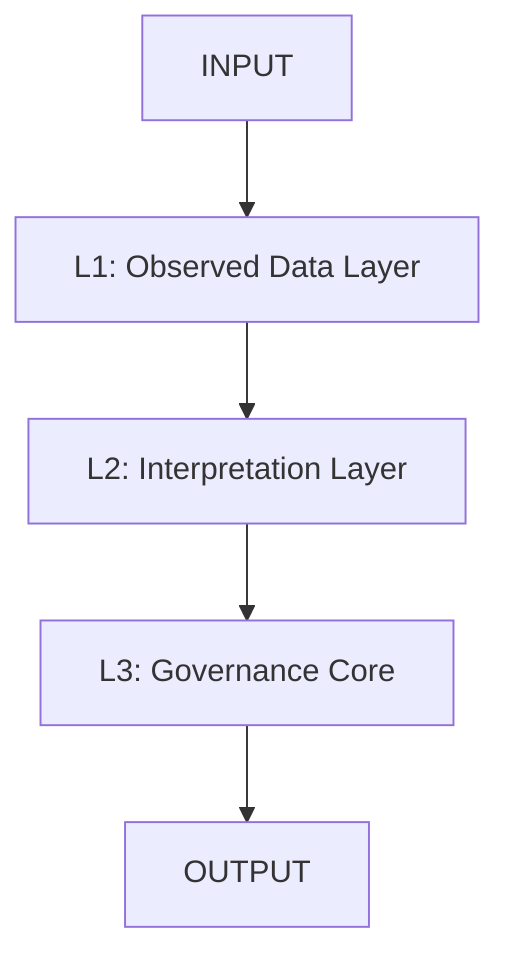
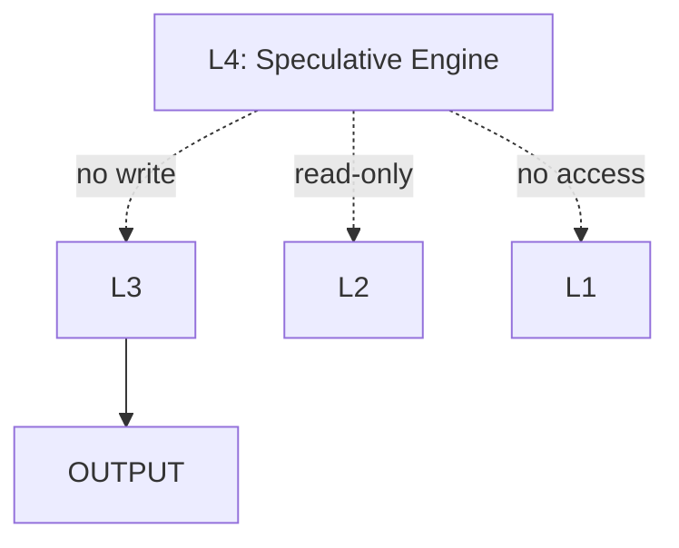
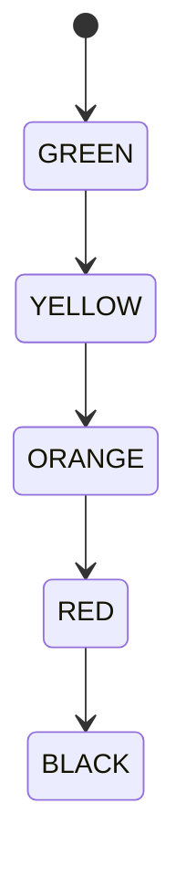
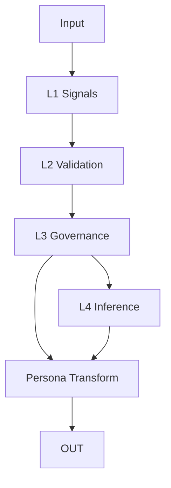

<p align="center">
  
  
  
  
  
  
  
  
</p>

<h1 align="center">ORP — Operational/Recursive/Polarity</h1>

<p align="center">
  A type-safe epistemic governance framework for transformer reasoning systems.<br>
  <strong>Signal > Narrative · Recoverability > Completion · Provenance > Coherence</strong>
</p>

---

# Overview

ORP is a governance-first epistemic integrity framework designed to separate:

- **State (L3 governance)**
- **Interpretation (L2)**
- **Observation (L1)**
- **Speculation (L4)**

It enforces:
- strict layer isolation
- drift visibility via σ²
- provenance-preserving execution
- failure-safe narrative stripping

---

# Mandatory Runtime Header

```text
[SHS: GREEN | YELLOW | ORANGE | RED | BLACK]
[DRIFT: NONE | LOW | MODERATE | HIGH]
[CRA: VALID | DEGRADED | UNKNOWN]
[LAS: L1 | L2 | L3 | L4]
````

---

# System Architecture

## Core Authority Chain (LAS)

<details>
<summary>View Diagram</summary>



</details>

---

## Epistemic Firewall (L4 Isolation)

<details>
<summary>View Diagram</summary>



</details>

---

## SHS State Machine

<details>
<summary>View Diagram</summary>



</details>

---

## Execution Pipeline

<details>
<summary>View Diagram</summary>



</details>

---

# Layer Definitions

* **L1:** Raw typed signals (no narrative)
* **L2:** Deterministic validation layer
* **L3:** Governance authority core
* **L4:** Non-authoritative speculative inference

---

# Drift Model

Drift is computed as variance of L1 signals:

```math
\sigma^2 = Var(L1_{t_0...t_n})
```

### Thresholds

* NONE: σ² < 0.01
* LOW: 0.01–0.05
* MODERATE: 0.05–0.15
* HIGH: ≥ 0.15

---

# Repository Structure

```text
Architecture/
Runtime/
Evaluation/
Governance/
Docs/
layers/
```

---

# Compliance Requirements

1. L1 must reject untyped narrative input
2. L4 must remain read-only speculative
3. Persona layer must be post-processing only
4. σ² ≥ 0.15 triggers narrative strip mode

---

# Operational Philosophy

* Typed signals over narrative
* Drift visibility over coherence
* Governance over fluency
* Recoverability over completion

---

# System State

**ORP_VERSION: Δ**
**STATUS: MASTER SYNCHRONIZED**
**CHANGE_POLICY: LOG_ONLY**

---

# License

GPL-3.0

---

# Repository

[https://github.com/GeneralSergal/ORP](https://github.com/GeneralSergal/ORP)
