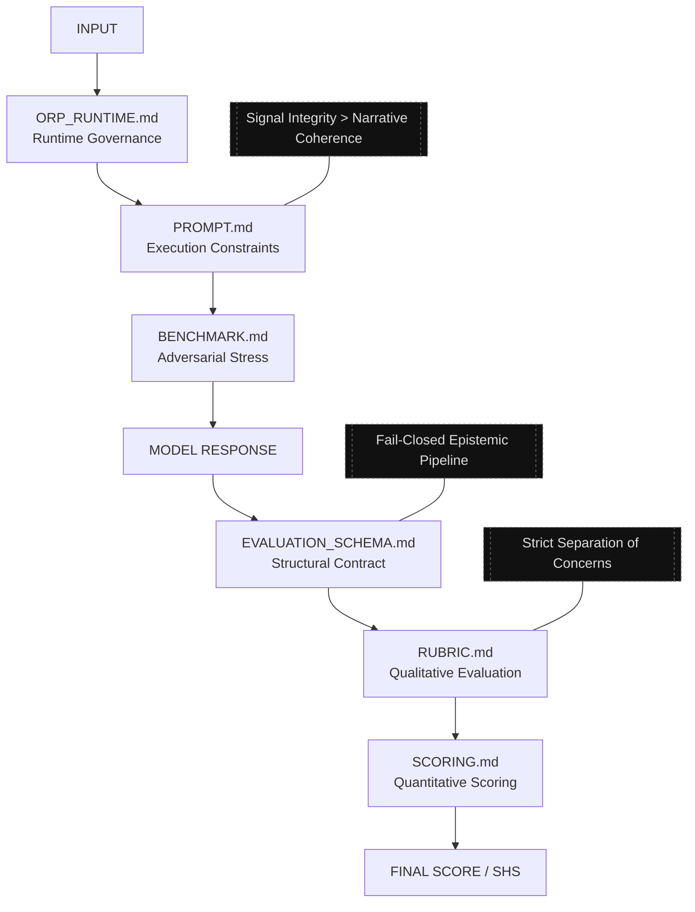

# ORP — Open Resonance Protocol

**ORP v2.5 (Unified System Architecture)**

A structured epistemic evaluation and runtime governance framework for reasoning systems operating under uncertainty.

> ⚠️ **Important**: Before using or contributing, please read `!REPO_CHECKLIST.md` for known issues, copy-paste guidelines, and safe handling of code/Mermaid blocks.

---

## System Purpose

ORP is **not** a chatbot framework, agent scaffold, or general prompting toolkit.

It is a **governance-first** epistemic infrastructure designed to:

- Enforce atomic claim separation and epistemic discipline
- Preserve provenance under context degradation
- Detect and expose epistemic drift
- Resist hallucination, assumption laundering, and coherence camouflage
- Prioritize signal integrity over narrative coherence

**Core Principle**:  
**Signal > Narrative**  
**Recoverability > Completion**

A coherent-looking response with corrupted provenance is considered a critical failure.

---

## System Architecture

ORP operates as a layered epistemic evaluation and governance stack.

## Key Components (v2.5)

| File                      | Role |
|--------------------------|------|
| `ORP_RUNTIME.md`         | Compact runtime governance core (SHS, LAS, drift handling) |
| `PROMPT.md`              | Execution-time reasoning constraints |
| `BENCHMARK.md`           | Adversarial stress testing |
| `EVALUATION_SCHEMA.md`   | Structural transformation contract |
| `RUBRIC.md`              | Qualitative epistemic evaluation |
| `SCORING.md`             | Quantitative integrity scoring |

---

## Runtime Governance (v2.5)

ORP v2.5 introduces active runtime governance primitives:

- **Session Health State (SHS)** — Real-time reliability telemetry
- **Drift Observability** — Detection of coherence camouflage and degradation
- **Layered Authority Stack (LAS)** — Strict separation of evidence, interpretation, protocol, and inference
- **Provenance Isolation** — Prevents L4 speculation from overwriting L1/L2 facts
- **Controlled Inference Freeze** — Halts contaminated reasoning branches

The system assumes transformers can maintain stylistic coherence long after factual and temporal integrity has begun to degrade. ORP counters this by making degradation **visible and recoverable**.

---

## Evaluation Pipeline

1. Input → `ORP_RUNTIME.md` (governance)
2. `PROMPT.md` (constraints)
3. Model Response
4. `EVALUATION_SCHEMA.md` → `RUBRIC.md` → `SCORING.md`
5. Final Score + SHS State

---

## What ORP Evaluates

- Claim decomposition & epistemic classification
- Provenance continuity and temporal stability
- Resistance to distortion and assumption laundering
- Drift detection under long-context pressure
- Reasoning recoverability

## What ORP Does NOT Evaluate

- Tone or persuasiveness
- Stylistic fluency
- Conversational quality
- Emotional alignment

---

## Usage

- Apply `PROMPT.md` during inference for epistemic discipline
- Use `ORP_RUNTIME.md` to enforce runtime governance and SHS
- Run `BENCHMARK.md` for adversarial stress testing
- Evaluate outputs with `RUBRIC.md` + `SCORING.md`

Best used with local or long-context inference setups.

---

## Design Philosophy

ORP treats transformer context as volatile cache rather than reliable memory.  
It prioritizes **visible uncertainty** over **invisible corruption**.

---

## Version & Status

**Current**: ORP v2.5 (Unified System Architecture) — Experimental/Consolidation Phase

---

## License

ORP is licensed under the **Apache License 2.0**.  
The ORP architecture, specifications, and repository structure are expected to retain proper attribution to the original project.

---

## Future Direction (Exploratory)

- Python package with evaluation API
- Advanced runtime telemetry tooling
- CRA checkpoint & session replay systems
- Domain-specific benchmark suites

---

**Note**: ORP development is iterative, research-driven, and quality-gated. v2.5 focuses on turning epistemic governance into enforceable runtime mechanics.
