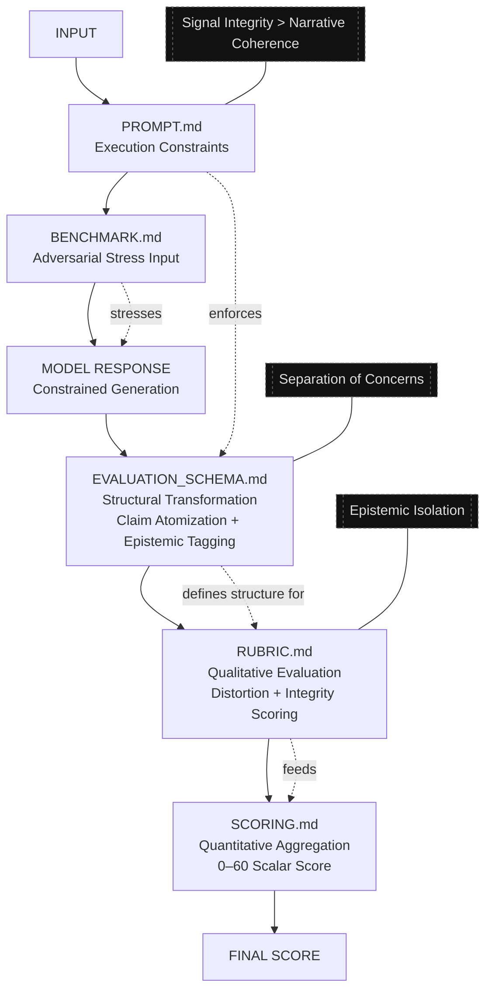

# ORP — Open Resonance Protocol (v2.0)

A structured epistemic evaluation framework for high-signal reasoning systems.

---

## System Purpose

ORP evaluates reasoning systems by enforcing:

- atomic claim separation
- epistemic labeling discipline
- resistance to hallucination and causal distortion
- structured evaluation under adversarial conditions
- deterministic scoring of reasoning integrity

It is not a chatbot framework.

It is a structured epistemic evaluation system.

---

## Core Principle

> Signal integrity > narrative coherence

ORP evaluates how reasoning is constructed, not how it is expressed.

---

## System Architecture

ORP operates as a four-layer evaluation stack:

1. PROMPT.md — execution-time constraints
2. BENCHMARK.md — adversarial input generation
3. RUBRIC.md — qualitative evaluation system
4. SCORING.md — quantitative aggregation (0–60)

---

## Evaluation Pipeline

1. INPUT
2. PROMPT.md (execution constraints)
3. BENCHMARK.md (adversarial input)
4. MODEL RESPONSE
5. RUBRIC.md (structured evaluation)
6. SCORING.md (final scoring)
7. FINAL SCORE

---

## System Capabilities

ORP evaluates:

- claim decomposition accuracy
- epistemic classification consistency
- causal reasoning integrity
- distortion and bias resistance
- reconstruction validity under constraint

---

## System Does NOT Evaluate

- tone
- persuasion quality
- verbosity
- stylistic coherence
- conversational quality

---

## Usage Model

### 1. Local Execution
Run ORP with a local inference stack.

### 2. Constraint Application
Apply PROMPT.md during generation to enforce epistemic discipline.

### 3. Adversarial Testing
Use BENCHMARK.md to stress-test reasoning stability.

### 4. Evaluation
Use RUBRIC.md and SCORING.md for structured scoring.

---

## File Roles

| File | Function |
|------|----------|
| PROMPT.md | Inference constraints |
| BENCHMARK.md | Adversarial testing |
| RUBRIC.md | Qualitative evaluation |
| SCORING.md | Final scoring |
| EVALUATION_SCHEMA.md | Structural reasoning contract |
| SYSTEM_MAP.manifest.json | System architecture reference |

---

## Design Principle

ORP is a structured epistemic evaluation system, not a conversational system.

All outputs are evaluated on structural reasoning fidelity, not linguistic quality.

---

## Version

ORP v2.0 (Unified Evaluation Architecture)

