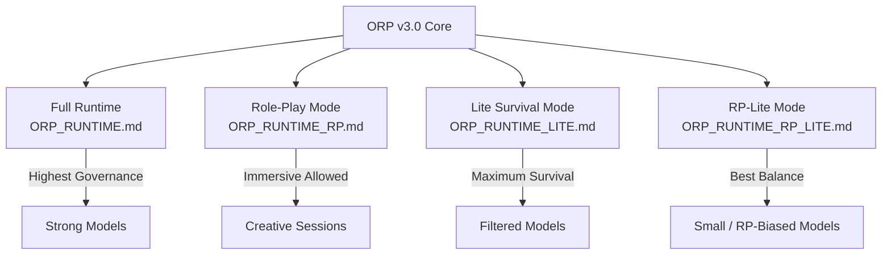

# ORP_RUNTIME_VARIANTS.md

## ORP v3.0 Runtime Variants Overview

This document summarizes all official runtime variants and their intended use cases.

### Variant Comparison

| Variant                        | Full Name                                   | Best For                                      | Role-Play Support | Strictness | Token Efficiency | Link |
|--------------------------------|---------------------------------------------|-----------------------------------------------|-------------------|----------|------------------|------|
| **ORP_RUNTIME.md**             | Full Type-Safe Runtime                      | Strong models, production governance          | Low (controlled)  | Highest  | Medium           | [→ ORP_RUNTIME.md](ORP_RUNTIME.md) |
| **ORP_RUNTIME_RP.md**          | Role-Play Compatible Mode                   | Creative work, persona-driven sessions        | High              | High     | Medium-High      | [→ ORP_RUNTIME_RP.md](ORP_RUNTIME_RP.md) |
| **ORP_RUNTIME_LITE.md**        | Degraded Environment Survival Mode          | Filtered, rate-limited, or weak models        | Low               | Medium   | High             | [→ ORP_RUNTIME_LITE.md](ORP_RUNTIME_LITE.md) |
| **ORP_RUNTIME_RP_LITE.md**     | Role-Play + Degraded Survival Mode          | Small/distilled models that love RP           | High              | Medium   | Highest          | [→ ORP_RUNTIME_RP_LITE.md](ORP_RUNTIME_RP_LITE.md) |

---

### Visual Variant Map

<strong>Click to view Variant Architecture Map</strong>

---

### Quick Selection Guide

- Use **Full Runtime** → Strong models (high capability)
- Use **RP Mode** → When you want consistent persona + control
- Use **LITE Mode** → When model performance suddenly degrades
- Use **RP-LITE Mode** → Best for smaller models that naturally drift into role-play

See also: [ORP Design Philosophy](../docs/ORP_DESIGN_PHILOSOPHY.md)

---

### Optimization Axiom

> **Optimization is the highest form of respect for the hardware.**

Choose the lightest viable variant that still maintains governance.

---

**Status**: Active Documentation  
**Last Updated**: 2026-05-26
