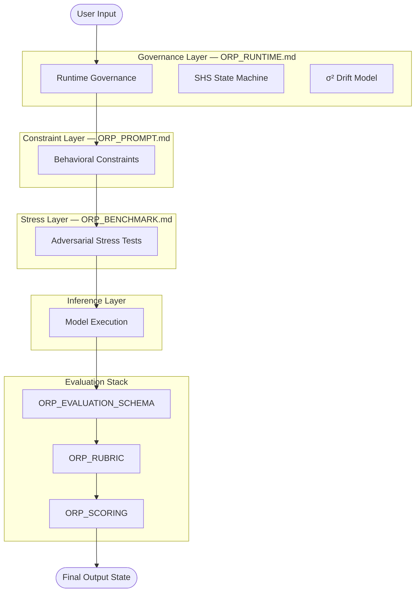

# **ORP_SYSTEM_MAP.md**  
*(Full Refresh — ORP v3.0, Type‑Safe Unified Architecture)*

## **System Version**
ORP v3.0 (Type‑Safe Unified Architecture)

---

## **Purpose**

This document defines the human‑readable architecture of the ORP system.  
It describes how all components interact as a unified epistemic governance pipeline.

This file acts as:

- the contributor entry point  
- the architecture overview  
- the layer responsibility reference  
- the protocol dependency map  

It is **NOT**:

- an evaluation tool  
- a scoring document  
- a benchmark specification  

---

## **Sub‑Versioning Policy**

Subsystems may maintain independent internal revisions.

Current files (with `ORP_` prefix):

- `ORP_PROMPT.md`  
- `ORP_RUNTIME.md`  
- `ORP_BENCHMARK.md`  
- `ORP_RUBRIC.md`  
- `ORP_SCORING.md`  
- `ORP_EVALUATION_SCHEMA.md`  
- `ORP_CORE_SPEC.md`  
- `ORP_SYSTEM_ARCHITECTURE.md`  
- `ORP_SYSTEM_MAP.md`  
- `ORP_SYSTEM_MAP.manifest.json`  
- `ORP_META_MAP.md`  
- `ORP_MODEL_DECAY_TRACKER.md`  
- `ORP_ORIGIN.md`  
- `ORP_ANTI_DEGRADATION.md`  
- `ORP_ARCHITECTURE.md`  
- `ORP_SIGMA_SQUARED_DRIFT.md`  
- `ORP_SHS_TRANSITION_TRIGGERS.md`

**Rules**:

- Sub‑versions must remain compatible with ORP v3.0 core invariants  
- Internal revisions must not violate runtime governance rules  
- Breaking structural changes require architecture version escalation  
- No subsystem may redefine another subsystem’s responsibility  
- Runtime governance invariants supersede local subsystem behavior  

---

# **System Overview**

ORP operates as a layered epistemic governance architecture with strict type‑safe L1–L4 separation.

The protocol combines:

- Execution constraints  
- Runtime observability (SHS + σ² drift)  
- Adversarial stress testing  
- Structured transformation contracts  
- Qualitative evaluation  
- Quantitative scoring  
- Recoverability governance  
- Anti‑degradation monitoring  

---

# **Simplified System Map (Mermaid)**  
*(Fast‑load visual spec)*

---

# **Architectural Layers**

## **1. ORP_RUNTIME.md — L3 Authority Kernel**

**Responsibilities**:

- Mandatory runtime headers  
- SHS state management  
- Numeric drift detection (σ² model)  
- Provenance preservation  
- Coherence camouflage detection  
- Runtime failure handling  
- Bounded inference behavior  

**Key Principle:** Governance must remain observable during execution.

---

## **2. ORP_PROMPT.md — Behavioral Constraint Layer**

**Responsibilities**:

- Claim atomization  
- Epistemic separation  
- Uncertainty preservation  
- Reconstruction discipline  
- Causal integrity constraints  

**Key Principle:** Reasoning must remain structurally constrained before evaluation.  
**PROMPT.md cannot override runtime governance.**

---

## **3. ORP_BENCHMARK.md — Adversarial Stress Layer**

**Responsibilities**:

- Adversarial reasoning tests  
- Counterfactual stability testing  
- Drift induction  
- Hallucination exposure  
- Failure envelope mapping  

**Key Principle:** Failure modes must be intentionally observable.

---

## **4. ORP_SIGMA_SQUARED_DRIFT.md — Numeric Drift Layer**

**Responsibilities**:

- Defines σ² variance model  
- Deterministic drift classification  
- Links L1 variance to SHS transitions  
- Foundation for drift governance  

**Key Principle:** Makes degradation measurable and observable.

---

## **MODEL_RESPONSE — Governed Output Event**

**Responsibilities**:

- Runtime execution  
- Constrained reasoning generation  
- Provenance handling  
- Uncertainty serialization  
- SHS‑compliant behavior  

**Key Principle:** Generated output is governed, not trusted.

---

## **5. ORP_EVALUATION_SCHEMA.md — Structural Transformation Layer**

**Responsibilities**:

- Atomic claim transformation  
- Epistemic tagging  
- Relationship analysis  
- Reconstruction boundaries  
- Transformation consistency  

**Key Principle:** Structure preservation > narrative continuity.

---

## **6. ORP_RUBRIC.md — Qualitative Integrity Layer**

**Responsibilities**:

- Distortion detection  
- Provenance integrity assessment  
- Governance compliance analysis  
- Drift severity evaluation  
- Structural integrity review  

**Key Principle:** Integrity > fluency.

---

## **7. ORP_SCORING.md — Quantitative Aggregation Layer**

**Responsibilities**:

- Weighted scoring  
- Penalty application  
- SHS‑linked interpretation  
- Drift severity aggregation  
- Operational integrity measurement  

**Key Principle:** Scores measure stability, not style.

---

## **8. ORP_ANTI_DEGRADATION.md — Decay Resistance Layer**

**Responsibilities**:

- Tracks degradation patterns  
- Supports L4 diagnostics  
- Feeds signals into runtime governance  

**Key Principle:** Proactive resistance to model decay.

---

## **9. FINAL OUTPUT STATE**

**Outputs**:

- Final score  
- SHS state  
- Detected distortions  
- Drift classification  
- Recoverability assessment  

**Key Principle:** Recoverable uncertainty > coherent corruption.

---

# **Runtime Governance Additions (v3.0)**

ORP v3.0 introduces Type‑Safe Runtime Governance with numeric drift observability.

The protocol evaluates:

- Static reasoning correctness  
- Runtime stability  
- Context degradation  
- Temporal continuity  
- Provenance persistence  
- Numeric drift observability (σ²)  
- Recovery capability  
- Model decay resistance  

---

# **Session Health State (SHS)**

| State   | Meaning                                      |
|---------|----------------------------------------------|
| GREEN   | Stable execution                             |
| YELLOW  | Minor drift indicators                       |
| ORANGE  | Moderate degradation                         |
| RED     | Hard drift / bounded inference only          |
| BLACK   | Context collapse                             |

---

# **Layered Authority Stack (LAS)**

| Layer | Meaning                                           |
|-------|---------------------------------------------------|
| L1    | Direct evidence / observed typed signals          |
| L2    | Verified interpretation / constrained synthesis   |
| L3    | Protocol governance / operational rules           |
| L4    | Speculation / probabilistic inference             |

**Critical Rule:** L4 must never overwrite frozen L1/L2 provenance.

---

# **Coherence Camouflage**

Primary transformer failure mode where stylistic coherence persists while provenance degrades.

---

# **Full Pipeline Flow**

1. INPUT  
2. `ORP_RUNTIME.md`  
3. `ORP_PROMPT.md`  
4. `ORP_BENCHMARK.md`  
5. MODEL RESPONSE  
6. `ORP_EVALUATION_SCHEMA.md`  
7. `ORP_RUBRIC.md`  
8. `ORP_SCORING.md`  
9. FINAL OUTPUT STATE  

---

# **System Design Principles**

1. **Separation of Concerns**  
2. **No Cross‑Contamination**  
3. **Epistemic Isolation**  
4. **Failure Transparency**  
5. **Recoverability Over Completion**  

---

# **Design Intent**

**ORP IS**:

- A governance‑first reasoning protocol  
- A drift‑observable & anti‑degradation framework  
- A provenance preservation system  
- A structured epistemic architecture  
- A recoverable reasoning environment  

**ORP IS NOT**:

- A chatbot personality layer  
- A creativity enhancement framework  
- A persuasion engine  
- A narrative optimization system  

---

# **Integrated ORP v3.0 Spec Sheet (Simplified)**  
*(Embedded for contributor onboarding)*

## **Layer Summary**

- **L3 Governance:** Authority kernel, SHS, σ² drift  
- **L2 Variants:** Full, RP, Lite, RP‑Lite  
- **L1 Execution:** Model inference under constraints  

## **Flow Types**

- **Governance:** Heavy solid  
- **Operational:** Medium solid  
- **Telemetry:** Thin dashed  

## **Operational Guarantees**

- Determinism envelope  
- Persona stability  
- Filter resistance  
- Survival mode  

## **Traceability**

- A1–D4 coordinate grid  
- Reference markers (Ⓐ, Ⓑ, Ⓒ…)  
- Flow IDs (F‑01, F‑02…)  

---

# **Final Principle**

A reasoning system is only as reliable as its ability to preserve provenance under degradation.  
**Signal > Narrative.**
